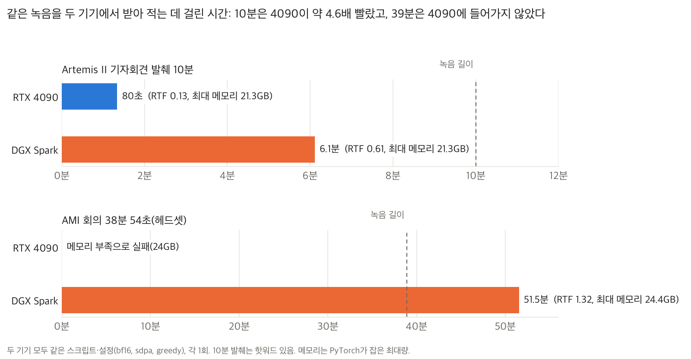
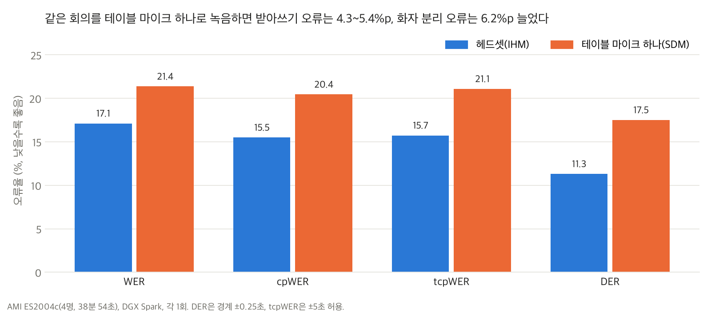
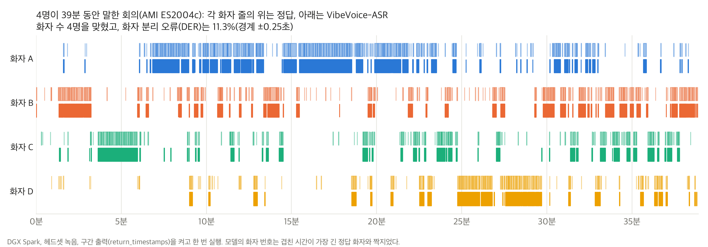
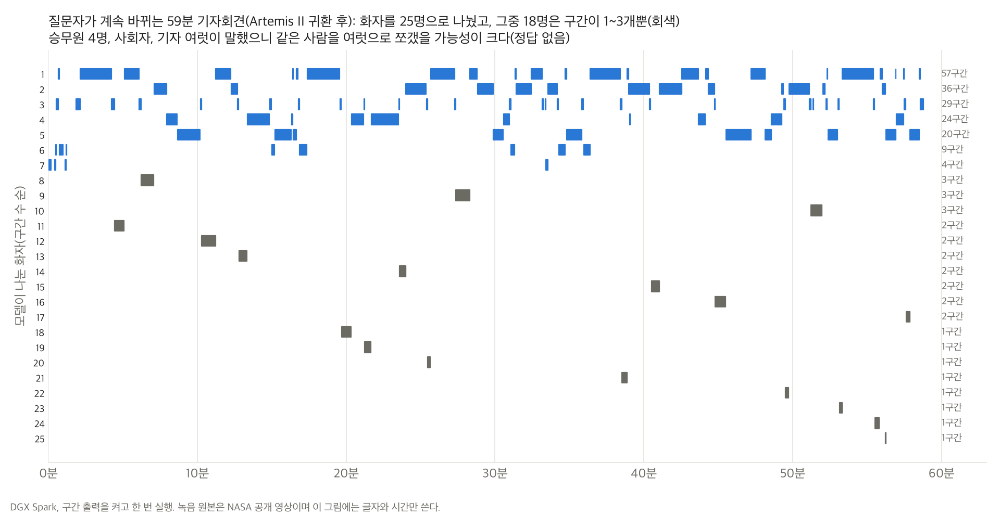
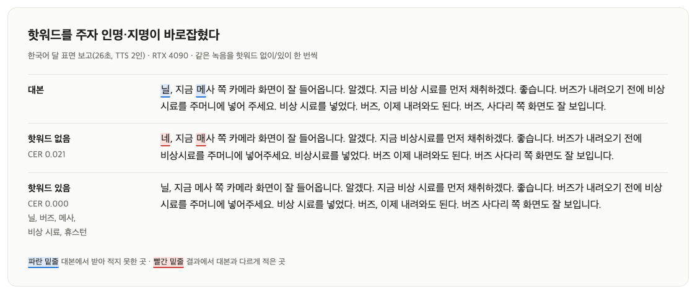
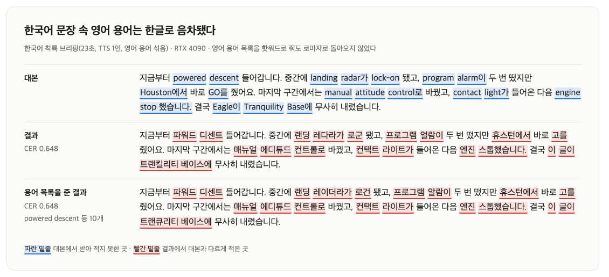
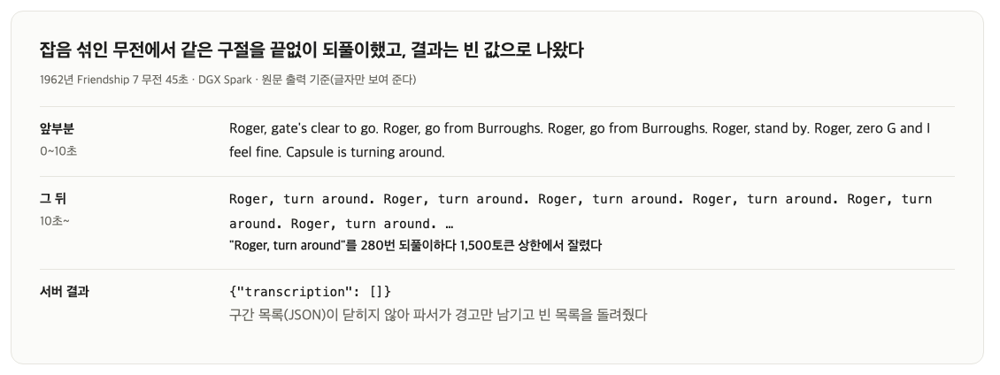
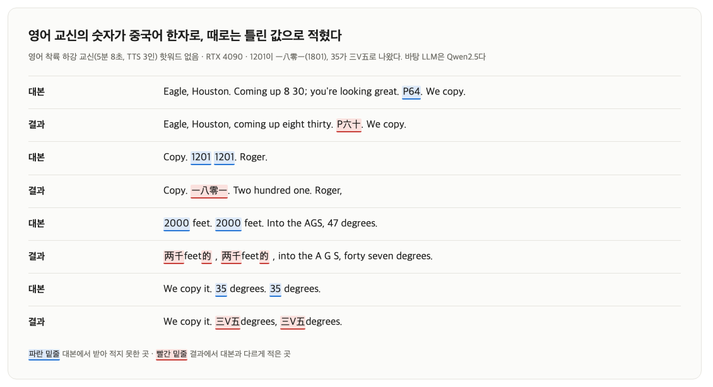

[English](README.md) · [한국어](README.ko.md) · [中文](README.zh-cn.md)

# speech-to-text-vibevoice

녹음 파일을 넣으면 받아 적어 주는 음성 인식 서비스다. 메모리가 넉넉하면 한 시간 가까운 회의도 자르지 않고 한 번에 넣을 수 있다.

Microsoft의 VibeVoice-ASR(8.7B)을 model-compose로 띄워 RTX 4090과 NVIDIA DGX Spark에서 실행했다. 이 모델이 내 기기에서 돌아가는지, 돌아가면 무엇을 잘하고 못하는지를 봤고, 다른 모델과는 짧은 낭독 문장에서만 Whisper large-v3와 비교했다(3.4절). Apple M2 16GB에는 원본 가중치가 들어가지 않아, 제3자가 4비트로 줄인 MLX 변환본으로 같은 녹음을 돌려 원본과 비교했다(2장). 스트리밍판(VibeVoice-ASR-Streaming)도 함께 시험했다(3.6절).

입력은 세 종류다. Apollo 11의 실제 교신 기록(NASA, 퍼블릭 도메인)을 대본으로 삼아 TTS로 읽힌 녹음, 공개 회의 녹음(AMI), NASA가 공개한 Artemis II 기자회견과 1962년 무전 녹음이다. 영어·한국어·중국어 독자가 각자 자기 언어의 결과를 찾을 수 있도록, 같은 낭독 문장(FLEURS)을 세 언어로 모두 돌렸고 핫워드·섞어 말하기·숫자도 언어마다 같은 시험을 했다.

결과는 언어 모델이 정답 대본과 나란히 읽어 초안을 쓰고 작성자 1인이 확정했으며, 글자 오류율(CER)과 단어 오류율(WER)을 함께 쟀다.


데모: 영어 교신과 한국어 통역이 번갈아 나오는 26초 녹음(TTS)을 웹 UI(gradio)에 올려 받아 적었다. RTX 4090에서 5.4초 걸렸고 화면은 배속하지 않았다. 이 레포의 기본 설정과 같은 설정(웹 UI, 구간 출력)으로 띄웠다.

## 목차

- [빠른 시작](#빠른-시작)
- [요약](#요약)
- [1 실험 환경](#1-실험-환경)
- [2 내 기기에서 돌아가는가](#2-내-기기에서-돌아가는가)
  - [16GB Mac에서는 4비트로 돌아간다](#16gb-mac에서는-4비트로-돌아간다)
- [3 기능별 결과](#3-기능별-결과)
  - [3.1 60분 단일 패스](#31-60분-단일-패스)
  - [3.2 화자 분리와 타임스탬프](#32-화자-분리와-타임스탬프)
  - [3.3 핫워드](#33-핫워드)
  - [3.4 언어별 정확도(언어 지정 없음)](#34-언어별-정확도언어-지정-없음)
  - [3.5 섞어 말하기(코드 스위칭)](#35-섞어-말하기코드-스위칭)
  - [3.6 스트리밍판(VibeVoice-ASR-Streaming)](#36-스트리밍판vibevoice-asr-streaming)
  - [3.7 숫자](#37-숫자)
- [4 권고](#4-권고)
- [5 한계와 측정하지 않은 것](#5-한계와-측정하지-않은-것)
- [라이선스](#라이선스)

## 모델

[`microsoft/VibeVoice-ASR`](https://huggingface.co/microsoft/VibeVoice-ASR)은 녹음을 받아 적으면서 누가(화자), 언제(타임스탬프) 말했는지도 함께 내는 음성 인식 모델이다. 가중치는 17.3GB다.
음성을 1초에 7.5토큰으로 압축해 LLM(Qwen2.5 기반)에 넣기 때문에 최대 60분 녹음을 자르지 않고 한 번에 처리한다. 50개가 넘는 언어를 지원하고, 언어를 따로 지정하지 않는다.

## 빠른 시작

[model-compose](https://github.com/hanyeol/model-compose)가 필요하다: `pip install model-compose`.

설정 파일 하나(`model-compose.yml`)로 띄운다:

```bash
model-compose up
```

모델이 올라가면 웹 UI(`http://localhost:8102`)가 열린다. 녹음을 올리면 화자 번호와 시각이 붙은 구간 목록이 나온다. HTTP API는 `http://localhost:8101/api`다. 포트를 바꾸려면 `.env.sample`을 `.env`로 복사해 `PORT`, `SERVER_PORT`를 고친다. 처음 띄울 때 torch를 설치하느라 몇 분에서 수십 분이 걸린다(설정에 `start_timeout: 30m`을 넣어 둔 이유다).

요청 예:

```bash
curl -o out.json localhost:8101/api/workflows/runs \
  -F workflow_id=transcribe -F wait_for_completion=true -F output_only=true \
  -F "input.audio=@meeting.wav" \
  -F "input.context_info=Tranquility Base, Eagle"
```

`context_info`는 고유명사·용어 목록(핫워드)이고 비워도 된다. 결과는 구간 목록(`{text, start_time, end_time, speaker_id}`)이다. 리포트의 측정은 전사 글만 받는 설정(`return_timestamps: false`, 워크플로 출력 `${output as text}`)으로 했다. 3.2절의 화자·시각 결과만 구간 출력을 켜고 쟀다.

**스트리밍판으로 띄우기.** `model-compose.yml`에서 네 곳을 바꾸면 결과가 조각 단위로 흘러나온다(3.6절).

- 컴포넌트의 `model`을 `microsoft/VibeVoice-ASR-Streaming-7B`로
- 워크플로 출력을 `${output as stream/text}`로
- 액션의 `return_timestamps`를 `false`로
- 액션의 `streaming`을 `true`로

요청은 위와 같고, curl에 `-N`을 붙이면 조각이 도착하는 대로 화면에 찍힌다.

**16GB Mac에서 돌리기.** 16GB Mac에는 원본 가중치(17.3GB)가 들어가지 않는다. 제3자 4비트 변환본 [`mlx-community/VibeVoice-ASR-4bit`](https://huggingface.co/mlx-community/VibeVoice-ASR-4bit)(5.7GB)을 [mlx-audio](https://github.com/Blaizzy/mlx-audio)로 직접 돌린다. model-compose에는 MLX 드라이버가 없다. mlx-audio는 시험판 transformers를 쓰므로 가상 환경을 따로 만든다([uv](https://docs.astral.sh/uv/) 필요).

```bash
uv venv .venv-mlx --python 3.12
uv pip install --python .venv-mlx/bin/python --prerelease=allow "mlx-audio==0.3.0"
.venv-mlx/bin/mlx_audio.stt.generate --model mlx-community/VibeVoice-ASR-4bit \
  --audio meeting.wav --output-path out --format json
```

`out.json`에 화자 번호와 시각이 붙은 구간 목록이 나온다. 핫워드는 `--context "Tranquility Base, Eagle"`로 준다.

## 요약

아래 결과는 4090 처리 시간(세 번씩)을 빼면 모두 한 번씩 잰 값이고, 입력 대부분이 합성 음성(TTS)이나 낭독이다. CER 0.01~0.02 차이는 잡음으로 본다.

1. 24GB RTX 4090은 35분 녹음까지 처리했고, 39분은 메모리가 부족했다. 긴 녹음을 같은 서버에 연달아 넣으면 30분에서도 모자랐다([2장](#2-내-기기에서-돌아가는가)).
2. 같은 10분 녹음에서 4090이 DGX Spark보다 약 4.6배 빨랐다. 16GB Mac에서는 4비트 변환본이 돌아가고, 원본과 거의 같은 글을 더 느리게 냈다([2장](#2-내-기기에서-돌아가는가)).
3. DGX Spark는 59분 녹음을 한 번에 받아 적었고, 4명 회의의 화자 수를 맞혔다([3.1](#31-60분-단일-패스), [3.2](#32-화자-분리와-타임스탬프)).
4. 같은 낭독 문장에서 영어가 가장 정확했고 중국어, 한국어 순이었다. 한국어와 중국어는 문장을 통째로 놓치기도 했다. 같은 문장에 언어를 지정한 Whisper large-v3는 한 문장도 놓치지 않았고, 한국어와 잡음 섞인 녹음에서 더 정확했다([3.4](#34-언어별-정확도언어-지정-없음)).
5. 핫워드는 한국어 문장과 영어 문장 속 한국 이름을 바로잡았지만, 영어 숫자·약어는 확실하게 고치지 못했다([3.3](#33-핫워드)).
6. 한국어 문장 속 영어 용어는 핫워드를 줘도 한글로 음차됐고, 중국어 문장 속에서는 영어로 남았다([3.5](#35-섞어-말하기코드-스위칭)).
7. 숫자 표기는 일정하지 않았다. 말로도 숫자로도 적었고, 영어 교신에서는 중국어 한자로 적기도 했다([3.7](#37-숫자)).
8. 잡음이 섞인 오래된 무전에서는 같은 구절을 반복하다 잘렸고, 그때 서버는 오류 없이 빈 결과를 돌려줬다([5장](#5-한계와-측정하지-않은-것)).
9. 스트리밍판은 첫 글자가 0.7~2.3초 만에 나왔고 실제 회의의 화자 4명을 나눴지만, TTS 목소리 네 개는 한 명으로 묶었다([3.6](#36-스트리밍판vibevoice-asr-streaming)).

표 1: 기기별 요약

| 기기 | 돌아가나 | 같은 10분 녹음 | 최대 메모리 |
|---|---|---|---|
| Apple M2 16GB | 원본은 들어가지 않는다. 4비트 변환본으로 돌아간다 | 7분 9초(RTF 0.71, 4비트) | 11.4GB(스왑 발생) |
| RTX 4090 24GB | 35분까지 돌아간다. 39분은 메모리 부족 | 1분 20초(RTF 0.13) | 21.3GB |
| DGX Spark | 59분까지 돌아간다 | 6분 7초(RTF 0.61) | 21.3GB(59분은 28.1GB) |

같은 10분 녹음은 Artemis II 기자회견 발췌를 기기마다 한 번씩 돌린 값이다(측정 방식과 메모리 기준은 표 3). Mac은 핫워드 없이 돌렸다. 4090과 DGX는 핫워드를 넣은 실행이지만, 핫워드 유무로 DGX 시간은 366.6초 대 369.3초로 거의 같았다.

표 2: 언어별 요약

| | 영어 | 한국어 | 중국어 |
|---|---|---|---|
| 낭독 문장, 깨끗한 녹음([3.4](#34-언어별-정확도언어-지정-없음)) | 19문장 중 0개 놓침, CER 0.009 | 20문장 중 3개 놓침, CER 0.032 | 19문장 중 2개 놓침, CER 0.025 |
| 낭독 문장, 잡음 5dB | 19문장 중 1개 놓침, CER 0.141 | 20문장 중 6개 놓침, CER 0.211 | 19문장 중 3개 놓침, CER 0.141 |
| 같은 문장, Whisper large-v3(언어 지정), 깨끗한 녹음 / 잡음 | 0개 놓침, CER 0.010 / 0.076 | 0개 놓침, CER 0.013 / 0.070 | 0개 놓침, CER 0.035 / 0.119 |
| 이름과 핫워드([3.3](#33-핫워드)) | 영어 이름은 핫워드 없이도 맞음. 영어 문장 속 한국 이름은 틀렸고 핫워드로 바로잡힘 | 이름이 틀렸고 핫워드로 바로잡힘(CER 0.021 → 0.000) | 이름은 핫워드 없이도 맞음. 녹음 첫 단어만 틀렸는데 음성 탓일 수 있음 |
| 문장 속 영어 용어([3.5](#35-섞어-말하기코드-스위칭)) | - | 핫워드를 줘도 한글로 음차 | 영어로 남음 |
| 숫자([3.7](#37-숫자)) | 대부분 영어 단어, 날짜·시각은 숫자. 교신에서는 중국어 한자가 섞임 | 한글 수사. 경보 코드는 틀림 | 한자 수사, 값은 모두 맞음 |
| 긴 녹음과 화자([3.1](#31-60분-단일-패스), [3.2](#32-화자-분리와-타임스탬프)) | 59분을 한 번에 처리. 회의 화자 4명을 맞힘 | 1분 21초까지만 시험 | 시험하지 않음 |

CER은 받아 적은 문장의 평균이고, `[Silence]` 같은 말 아닌 소리 표시는 지우고 쟀다. 낭독 문장은 세 언어가 같은 내용을 읽은 FLEURS 문장이며, DGX에서 한 번씩 돌렸다.

## 1 실험 환경

표 3: 측정 기기와 방식. 어느 결과가 어떤 방식으로 나왔는지 여기서 찾는다.

| 기기 | 실행 방식 | 메모리 기준 | 해당 결과 |
|---|---|---|---|
| RTX 4090(24GB, 공용) | model-compose 0.4.109 서버. 다른 작업이 없을 때 | GPU 전체 사용량 | 표 4와 2장의 최대 길이 표, 10(DGX 행 제외), 11, 13(한국어 행), 14, 표 12의 Whisper 행, 그림 5·6·8 |
| RTX 4090 | DGX와 같은 직접 호출 스크립트 | PyTorch 최대량 | 표 1의 4090 행, 그림 1 |
| DGX Spark(GB10, 120GB 통합, 공용) | transformers를 직접 호출하는 스크립트 | PyTorch 최대량 | 표 1·5·9·16, 표 6의 원본 값, 그림 1~4·7 |
| DGX Spark | model-compose 0.4.109 서버. 다른 작업이 없을 때 | 재지 않음 | 세 언어 시험: 표 10·13의 DGX 행, 표 12의 VibeVoice 행, 표 15 |
| MacBook(Apple M2, 16GB 통합) | mlx-audio 0.3.0 스크립트(4비트 변환본). 다른 앱을 켜 둔 채, 스왑 8~10GB 사용 중 | MLX 최대량 | 표 1의 Mac 행, 표 6 |
| MacBook(Apple M2) | 같은 스크립트를 model-compose 서버의 셸 컴포넌트로 감쌈 | 재지 않음 | 표 7, 무음·잡음 시험 |

메모리 기준이 다른 값은 섞어 비교하지 않는다. GPU 전체 사용량은 같은 실행이라도 PyTorch 최대량보다 크게 나온다.

- 가중치는 `microsoft/VibeVoice-ASR` 리비전 `d0c9efdb`, bf16, attention은 sdpa, greedy 디코딩(temperature 0, beam 1)이다.
- Mac만 제3자 4비트 변환본 `mlx-community/VibeVoice-ASR-4bit`(리비전 `a1a15cb6`)을 mlx-audio 0.3.0(mlx 0.32.3)으로 돌렸다. 처리 시간은 모델을 한 번 올려 둔 스크립트로 잰 값이라 로딩(약 5초)이 빠져 있다.
- 4090은 model-compose 0.4.109로 서버를 띄워 요청을 보냈다. 서버를 띄운 뒤 짧은 녹음으로 한 첫 요청(워밍업)과 모델 로딩(약 20초)은 시간에서 뺐다. 19분까지는 같은 녹음을 세 번씩 돌렸다. 25분부터는 길이마다 서버를 새로 띄워 한 번씩 넣었고, 입력은 영어 TTS 교신을 이어 붙여 길이를 맞춘 녹음이다. 메모리는 내용이 아니라 녹음 길이에 따라 는다.
- 비교용 Whisper large-v3(리비전 `06f233fe`)는 4090에서 model-compose 0.4.109 서버(Hugging Face 드라이버, 기본 설정)로 FLEURS 클립마다 언어를 지정해 한 번씩 돌렸다.
- 입력
  - Apollo 11 교신 녹음 15개: NASA의 1969년 교신 기록(공대지 기술 교신, 공보관 해설)을 대본으로 삼아 Qwen3-TTS CustomVoice의 프리셋 목소리로 읽혔다. 실제 우주비행사의 목소리를 쓰거나 흉내 내지 않았다. 한국어·일본어 대본은 원문을 번역해 다듬은 것이다. VibeVoice 계열 TTS는 쓰지 않았다(이 모델의 학습 데이터 일부가 VibeVoice TTS 합성이라 평가가 유리해질 수 있다).
  - 4090 최대 길이 시험용: 이 영어 교신 녹음들을 0.5초 쉼으로 이어 붙여 25·30·35·39분으로 자른 녹음 4개. 일부 구간이 반복된다.
  - AMI 회의 ES2004c(4명, 38분 54초): 같은 회의를 헤드셋(IHM)과 테이블 마이크 하나(SDM)로 동시에 녹음한 공개 데이터다.
  - Artemis II 귀환 기자회견(NASA 공개 영상, 59분 24초)과 그 앞 10분 발췌.
  - 1962년 Friendship 7 무전 클립(NASA 공개 녹음, 45초·100초)과 잡음 녹음(무음·백색·핑크·무전 대역, 각 90초).
  - Mac만: FLEURS 한국어 낭독 20문장(문장당 6~14초)을 그대로, 그리고 백색 잡음을 SNR 5dB로 섞어 두 번씩. 무음 30초, 합성 잡음 60초, 낭독 뒤 무음이 이어지는 녹음.
  - DGX, 세 언어: 원본 모델로 돌린 FLEURS 한국어 20문장과, 같은 문장을 중국어(표준 중국어)·영어로 읽은 녹음. FLEURS는 한 벌의 문장을 모든 언어로 읽히므로 세 언어가 같은 내용을 읽는다. 한 문장(1888번)은 중국어·영어 대본에 숫자나 로마자가 들어 있어 이 두 언어는 19문장이다. 깨끗한 녹음과 백색 잡음 SNR 5dB로 한 번씩.
  - DGX, TTS 녹음 8개 추가: 한국어 핫워드·섞어 말하기 대본의 중국어판(목소리 serena, uncle_fu), 한국·중국 이름이 들어간 영어 문장, 같은 숫자 문장 일곱 개의 한국어·영어·중국어판. 이 대본들은 언어 모델이 썼다. TTS가 대본대로 읽었는지 모든 문장을 Whisper로 받아 적어 확인했다. Whisper가 틀린 문장 중 한국어는 작성자가 직접 들었고, 중국어는 중국어 전용 인식 모델(FunASR Paraformer)로 한 번 더 확인했다. 중국어 원어민은 듣지 않았다.
- 판정: 결과 글은 언어 모델(Claude)이 정답 대본과 나란히 두 번 따로 읽고 초안을 썼다. 언어 모델은 녹음을 듣지 못하고 글만 읽었다. 초안은 작성자가 녹음을 들으며 확정했고, 초안을 그대로 둔 비율은 93%(15건 중 14건)다.
- 점수: CER·WER은 문장부호·공백·대소문자를 지운 뒤 잰 값이다. 모델이 말 아닌 소리에 붙이는 `[Silence]` 같은 표시는 지우고 쟀고, 표시만 나온 문장은 놓친 것으로 셌다. 중국어는 단어 사이에 띄어쓰기가 없어 CER만 적었다. 숫자 표기("7"과 "seven")는 맞추지 않아서 영어 교신에서는 실제보다 높게 나온다. 그래서 영어는 Whisper 영어 정규화기로 양쪽을 맞춘 WER을 함께 적었다.

## 2 내 기기에서 돌아가는가

표 4: RTX 4090 녹음 길이별 처리 시간(3회 중앙값)

| 녹음 | 길이 | 처리 시간 | 3회 차이 | RTF | 최대 VRAM |
|---|---|---|---|---|---|
| 한국어 상태 보고 | 24.5초 | 2.6초 | 0.1% | 0.11 | 17.4GB |
| 한국어 상태 보고 | 1분 21초 | 9.9초 | 0.4% | 0.12 | 21.4GB |
| 영어 발사 교신 | 2분 23초 | 22.1초 | 0.5% | 0.15 | 21.5GB |
| 영어 착륙 하강 교신 | 5분 8초 | 38.7초 | 2.7% | 0.13 | 21.5GB |
| 영어 착륙 교신 | 9분 6초 | 1분 40초 | 1.1% | 0.18 | 22.7GB |
| 영어 첫 EVA 교신 | 18분 58초 | 4분 13초 | 0.4% | 0.22 | 22.9GB |

**RTF.** 받아 적는 데 걸린 시간을 녹음 길이로 나눈 값이다. 1보다 작으면 녹음을 듣는 것보다 빨리 끝난다. 이 모델은 받아 적은 글을 한 토큰씩 만드는데, 녹음이 길수록 토큰 하나를 만들 때 참조할 입력이 늘어서 RTF가 커진다. 9분 녹음은 100초, 19분은 253초로 길이는 약 두 배인데 시간은 2.5배였다. 35분은 660초(RTF 0.31)였다.

- 핫워드를 붙여도 처리 시간은 거의 같았다(영어 하강 교신, 각 1회 39.7초 → 39.1초).
- 같은 녹음을 세 번 돌린 처리 시간은 서로 3% 안에서 같았다.
- 3회 차이는 (가장 긴 시간 − 가장 짧은 시간) ÷ 중앙값이다.

**최대 길이.** 영어 교신을 이어 붙여 길이만 바꾼 녹음으로, 길이마다 서버를 새로 띄워 한 번씩 넣었다.

| 길이 | 결과 | 처리 시간 | RTF | 최대 VRAM |
|---|---|---|---|---|
| 25분 | 완주 | 6분 34초 | 0.26 | 22.1GB |
| 30분 | 완주 | 8분 49초 | 0.29 | 23.0GB |
| 35분 | 완주 | 11분 0초 | 0.31 | 23.0GB |
| 39분 | 메모리 부족 | - | - | - |

새 서버에서 잰 값이라, 같은 서버에서 여러 요청을 돌린 뒤 잰 표 4의 19분보다 VRAM(GPU 전체 사용량)이 낮게 나올 수 있다.

- 4090(24GB)에는 35분 녹음까지 들어갔다(23.0GB). 39분은 5.0GB를 더 잡으려다 메모리 부족으로 멈췄다. 한계는 35분과 39분 사이다.
- 긴 녹음을 같은 서버에 연달아 넣으면 더 짧은 길이에서 실패한다. 25분 바로 뒤에 같은 서버로 넣은 30분은 메모리가 모자랐다. 앞 요청이 끝난 뒤에도 PyTorch가 3.5GB를 비워 둔 채 쥐고 있었기 때문이고, 새 서버에서는 같은 30분이 끝까지 돌았다.

표 5: DGX Spark 녹음 길이별 처리 시간(직접 호출, 각 1회)

| 녹음 | 길이 | 처리 시간 | RTF | 최대 메모리 |
|---|---|---|---|---|
| Artemis II 기자회견 발췌 | 10분 | 6분 7초 | 0.61 | 21.3GB |
| AMI 회의(테이블 마이크) | 38분 54초 | 50분 36초 | 1.30 | 24.4GB |
| AMI 회의(헤드셋) | 38분 54초 | 51분 30초 | 1.32 | 24.4GB |
| Artemis II 기자회견 전체 | 59분 24초 | 85분 36초 | 1.44 | 28.1GB |

- DGX에서 10분 녹음은 녹음보다 빨리 끝났고, 39분과 59분 녹음은 녹음보다 오래 걸렸다. 그 사이 길이는 재지 않아 어디서 넘어가는지는 모른다.

**같은 파일로 비교.** 표 4와 표 5는 녹음과 재는 방식이 달라 기기끼리 바로 비교할 수 없다. 그래서 DGX에서 잰 녹음 두 개를 4090에서도 같은 스크립트·설정으로 한 번씩 돌렸다.



그림 1: 같은 녹음을 두 기기에서 받아 적는 데 걸린 시간.

- 10분 발췌는 4090이 80초, DGX가 367초로 약 4.6배 빨랐다. 초당 생성 토큰은 41.5개 대 8.9개였다.
- 39분 회의는 4090에서 시작 14초 만에 메모리 부족으로 멈췄다. 10분 발췌 바로 뒤에 같은 프로세스로 넣은 실행이었지만, 새 서버에 39분 TTS 녹음만 넣어도 메모리가 모자랐다. DGX에서는 24.4GB를 쓰고 51분 30초가 걸렸다.
- 10분 발췌의 최대 메모리는 둘 다 21.3GB였다. 결과 글의 단어 수도 1,986 대 1,983으로 거의 같았다.
- 같은 4090에서도 이 10분 녹음(RTF 0.13)이 표 4의 9분 TTS 교신(0.18)보다 빨랐다. 녹음 내용과 재는 방식(스크립트, model-compose 서버)이 모두 달라 원인은 가르지 못했고, 표 4와 그림 1의 값은 섞어 비교하지 않는다.

### 16GB Mac에서는 4비트로 돌아간다

원본 가중치를 4비트로 줄인 MLX 변환본은 5.7GB다(원본 17.3GB). 이 변환본으로 원본을 돌린 녹음 세 개를 다시 받아 적고, 결과를 원본과 나란히 놓았다.

표 6: Apple M2 16GB 4비트와 원본 비교(각 1회)

| 녹음 | 길이 | Mac 처리 시간 | Mac 최대 메모리 | 화자 수(정답 / 원본 / Mac) | WER 원본 | WER Mac |
|---|---|---|---|---|---|---|
| AMI 회의(헤드셋) 19:00~20:00 | 1분 | 1분 28초(RTF 1.47) | 7.7GB | 4 / 4 / 2 | 0.301 | 0.277 |
| AMI 회의(헤드셋) 19:00~24:00 | 5분 | 5분 18초(RTF 1.06) | 9.6GB | 4 / 4 / 4 | 0.229 | 0.230 |
| Artemis II 기자회견 발췌 | 10분 | 7분 9초(RTF 0.71) | 11.4GB | 정답 없음 / 9 / 10 | - | 원본과 2% 다름 |

원본 값은 모두 DGX 결과다. AMI 두 줄은 회의 전체(39분)를 한 번에 받아 적은 결과에서 같은 구간을 잘라 냈고, WER은 3.6절과 같은 방식으로 쟀다. 10분 발췌는 정답 대본이 없어서, 같은 조건(핫워드 없음)으로 돌린 DGX 원본 결과 글을 기준으로 Mac 결과 글의 단어 차이를 쟀다. Mac 처리 시간에는 모델 로딩이 빠져 있다.

- **받아 적는 내용은 원본과 거의 같았다.** 10분 발췌는 1,995단어 대 2,009단어였고, 단어의 2%가 달랐다(표 6). AMI 5분의 WER도 0.230 대 0.229였다. 영어 회의와 기자회견에서는 4비트로 줄여도 결과가 거의 바뀌지 않았다.
- **화자 구분은 짧은 녹음에서 흔들렸다.** AMI 1분에서는 4명을 2명으로 묶었다. 같은 4명이 나오는 5분 구간에서는 원본처럼 4명을 모두 나눴다. 10분 발췌는 원본이 9명, Mac이 10명으로 나눴다.
- **짧은 녹음은 실시간보다 느렸다.** 1분 녹음은 녹음보다 1.5배 오래 걸렸다. 녹음이 길수록 RTF가 내려가 5분은 녹음과 비슷했고, 10분은 7분 9초로 녹음보다 빨리 끝났다. 같은 10분 녹음을 핫워드 없이 DGX는 6분 9초에 끝냈다(4090은 핫워드를 넣은 실행만 있고 1분 20초).
- **메모리는 녹음 길이에 따라 7.7GB에서 11.4GB까지 늘었다.** 측정 중 스왑이 8~10GB 쓰이고 있었다. 다른 앱을 닫으면 더 빠를 수 있다.

**짧은 한국어 문장.** FLEURS 한국어 낭독 20문장을 model-compose 서버로 두 번씩 보냈다. 두 번의 결과는 모두 같았다.

표 7: FLEURS 한국어 20문장(Mac 4비트)

| 조건 | 받아 적은 문장 | 통째로 놓친 문장 | 받아 적은 문장의 CER(중앙값 / 평균) | 정확히 맞힌 문장 |
|---|---|---|---|---|
| 깨끗한 녹음 | 15 | 5 | 0.000 / 0.029 | 8 |
| 백색 잡음 SNR 5dB | 13 | 7 | 0.222 / 0.328 | 0 |

- **받아 적은 문장은 대체로 정확했다.** 깨끗한 녹음 15문장 중 8개는 띄어쓰기·문장부호를 빼면 한 글자도 틀리지 않았다. 틀린 곳은 주로 외래 고유명사였다("카사블랑카"→"가사 블랑카", "듀발"→"쥐발", "피히테"→"피히트의"). 가장 많이 틀린 문장은 "플리트비체 호수 국립공원은"을 "플리프 빛의 호소 공익공원은"으로 적었다(CER 0.189).
- **놓친 문장은 결과가 `[Silence]`나 `[Music]` 표시 하나뿐이었다.** 8~14초 길이의 낭독 문장이고, 소리 크기와도 관계가 없었다(놓친 문장 중에는 받아 적은 문장 대부분보다 소리가 큰 것도 있다). 놓친 문장 두 개를 model-compose 없이 스크립트로 직접 넣어도 같았다. 원본(DGX)도 같은 깨끗한 20문장 중 3개를 놓쳤지만 그중 같은 문장은 하나(1879번)뿐이었다. 문장을 통째로 놓치는 현상이 4비트 탓만은 아니다(3.4절).
- **잡음을 섞으면 크게 나빠졌다.** 놓친 문장이 7개로 늘었고, 받아 적은 13문장도 CER 중앙값이 0.222였다. "낭만주의는"이 "남만주 의"로 바뀌고, 플리트비체 국립공원 문장은 전혀 다른 문장이 됐다.
- **무음과 잡음만 있는 녹음에서는 말을 지어내지 않았다.** 무음 30초와 합성 잡음 60초는 `[Silence]` 하나만 나왔고, 낭독 뒤 무음이 이어지는 녹음은 문장을 받아 적은 뒤 `[Silence]`만 붙였다. 원본의 잡음 시험(5장)과 같은 모습이다.

## 3 기능별 결과

표 8: 공식이 내세운 기능

| 공식이 내세운 기능 | 우리 결과 |
|---|---|
| 60분 길이 단일 패스 | 35분(4090)과 59분(DGX) 녹음을 자르지 않고 끝까지 받아 적었다. 4090(24GB)은 39분 녹음에서 메모리가 모자랐다. |
| 화자 분리·타임스탬프 | 4인 회의에서 화자 수를 맞혔고 DER 11.3%(헤드셋)였다. 질문자가 계속 바뀌는 기자회견은 화자를 25명으로 쪼갰다. |
| 사용자 지정 핫워드 | 한국어 인명·지명은 한국어 문장에서도 영어 문장에서도 바로잡혔다. 중국어 이름은 핫워드 없이도 맞았다. 영어 숫자·약어는 거의 바뀌지 않았다. |
| 50개 이상 언어·언어 지정 없음 | 한국어·영어·중국어·일본어를 모두 그 언어 글자로 적었다. 같은 낭독 문장에서는 영어가 가장 정확했고 중국어, 한국어 순이었으며, 언어를 지정한 Whisper large-v3보다 정확하지 않았다. 일본어 CER은 0.169로 오류가 더 많았다. |
| 코드 스위칭 | 줄마다 언어가 바뀌는 녹음은 따라갔다. 한국어 문장 속 영어 용어는 한글로 음차했고, 중국어 문장 속에서는 영어로 남았다. |
| 스트리밍(별도 체크포인트) | 첫 글자가 0.7~2.3초 안에 나왔고, 실제 회의에서는 화자 4명을 나눴다. TTS 목소리 네 개는 한 명으로 묶었다. |

### 3.1 60분 단일 패스

> 공식 GitHub: "VibeVoice ASR accepts up to 60 minutes of continuous audio input within 64K token length."

- **4090, 18분 58초 EVA 교신:** 자르지 않고 넣어 끝까지 받아 적었다. 결과는 "Okay, Houston, I'm on the porch."로 시작해 "That's one small step for man, one giant leap for mankind."를 거쳐 "We've got this view, Neil."로 끝났다. 같은 구절이 되풀이되는 곳은 없었다.
- **DGX, 59분 24초 Artemis II 귀환 기자회견:** 230개 구간, 약 10,800단어가 나왔고 마지막 구간이 녹음 끝(59:23)까지 이어졌다. 앞뒤의 음악과 장내 소음은 `[Music]`, `[Environmental Sounds]`로 따로 표시했다. 최대 메모리는 28.1GB였다.
- **4090, 38분 54초 AMI 회의:** 메모리 부족으로 시작하자마자 멈췄다. 4090에서는 TTS 교신을 이어 붙인 35분 녹음까지 끝까지 돌았고 39분에서 메모리가 모자랐다(2장). 60분 가까운 녹음을 한 번에 넣으려면 24GB보다 큰 메모리가 필요하다.

### 3.2 화자 분리와 타임스탬프

4090 측정은 전사 글만 돌려받게 설정해서 화자와 시각을 재지 않았다. 아래는 DGX에서 구간 출력을 켜고 잰 결과다.

표 9: AMI 회의 ES2004c(4명, 38분 54초). 같은 회의를 두 마이크로 동시에 녹음했다.

| 지표 (%, 낮을수록 좋음) | 헤드셋 | 테이블 마이크 | 논문 헤드셋 | 논문 테이블 마이크 |
|---|---|---|---|---|
| WER(단어 오류율) | 17.12 | 21.37 | 18.81 | 24.65 |
| cpWER(화자별로 묶은 WER) | 15.50 | 20.45 | 20.41 | 28.82 |
| tcpWER(시각까지 맞아야 하는 WER, ±5초) | 15.74 | 21.09 | 20.82 | 29.80 |
| DER(화자 분리 오류, 경계 ±0.25초) | 11.31 | 17.51 | 11.92 | 13.43 |
| 화자 수(정답 4) | 4 | 4 | - | - |



그림 2(DGX): 같은 회의, 마이크만 다르게 녹음했을 때의 오류율.

- 고정된 4명이 39분 내내 말한 회의에서는 두 마이크 모두 화자 수를 맞혔다. tcpWER이 cpWER보다 0.2~0.6%p만 높아 시각도 적어도 지표의 ±5초 범위 안에서는 맞았다.



그림 3(DGX): AMI 회의 39분의 화자 타임라인. 화자마다 위 줄은 정답, 아래 줄은 모델이 나눈 구간이다.

- 테이블 마이크 하나로 녹음하면 WER이 4.3%p, DER이 6.2%p 늘었다. 노트북이나 휴대폰 하나로 회의를 녹음하는 상황에 가깝다.
- 질문자가 계속 바뀌는 59분 기자회견에서는 화자를 25명으로 나눴다. 구간이 1~3개뿐인 화자가 18명이라 같은 사람을 여럿으로 쪼갰을 가능성이 크다(정답 없음).



그림 4(DGX): Artemis II 귀환 기자회견 59분. 모델이 나눈 화자를 구간 수 순으로 놓았다. 회색은 구간이 1~3개뿐인 화자다.

- 논문 수치는 테스트 세트 전체, 우리 수치는 회의 1건이라 같은 수준이라고만 읽는다. DER은 경계 허용 범위에 따라 두 배 가까이 달라진다(허용 없이 20.25%). AMI는 널리 쓰이는 공개 데이터라 사전학습에 섞였을 가능성도 배제할 수 없다.

### 3.3 핫워드

> 모델 카드: "Users can provide customized hotwords (e.g., specific names, technical terms, or background info) to guide the recognition process, significantly improving accuracy on domain-specific content."

같은 녹음을 핫워드 없이/있이 한 번씩 넣었다.



그림 5(4090): 핫워드 전후. 띄어쓰기와 쉼표 차이는 점수와 같은 기준으로 표시하지 않았다.

표 10: 핫워드 유무에 따른 점수 변화(4090. DGX라고 표시한 행은 DGX에서 돌렸다)

| 녹음 | 핫워드 | CER | WER |
|---|---|---|---|
| 한국어 달 표면 보고 | 닐, 버즈, 메사, 비상 시료, 휴스턴 | 0.021 → **0.000** | 0.278 → 0.056 |
| 한국어 착륙 호출 | 이글, 컬럼비아, 트랭퀼리티 베이스, 프로그램 알람, 동력 하강 | 0.056 → **0.016** | 0.184 → 0.053 |
| 영어 착륙 하강 교신 | Eagle, Columbia, Tranquility Base, DELTA-H, PGNS, AGS, P64 | 0.387 → 0.390 | 0.376 → 0.357 |
| 중국어 달 표면 보고(DGX) | 尼尔, 巴兹, 台地, 应急样本, 休斯敦(닐, 버즈, 메사, 비상 시료, 휴스턴) | 0.027 → **0.000** | - |
| 중국어 착륙 호출(DGX) | 鹰号, 哥伦比亚号, 静海基地, 程序警报, 动力下降(이글, 컬럼비아, 트랭퀼리티 베이스, 프로그램 알람, 동력 하강) | 0.022 → 0.022 | - |
| 한국·중국 이름이 든 영어 문장(DGX) | Yi So-yeon, Nuri, Naro Space Center, Goheung, Danuri, Yang Liwei, Jiuquan, Wang Yaping, Zhai Zhigang, Tiangong, Chang'e, Tianwen, Wenchang | 0.058 → 0.024 | 0.131 → 0.048 |

영어 하강 교신을 숫자 표기까지 맞춘 WER로 다시 재면 22.6%에서 20.3%로 조금 내려갔다.

- **한국어 달 표면 보고는 핫워드를 넣자 고유명사가 모두 맞았다.** 핫워드 없이는 "닐, 지금 메사 쪽"이 "네, 지금 매사 쪽"으로 적혔다. 핫워드를 넣자 "닐"과 "메사"가 대본과 같아졌다. "버즈"와 "비상 시료"는 핫워드 없이도 맞았다("비상시료"로 띄어쓰기만 달랐다).
- **한국어 착륙 호출은 일부만 고쳐졌다.** "슈스턴"은 "휴스턴", "콜럼비아"는 "컬럼비아"로 바로잡혔지만, 목록에 넣은 "트랭퀼리티 베이스"는 "트랭큘리티 베이스"로 나왔다.
- **영어 하강 교신은 거의 바뀌지 않았다.** "Eagle"(9번)과 "Tranquility Base"는 핫워드 없이도 대본과 같아서 고칠 것이 없었다. 틀린 곳은 숫자와 약어였다. "Both odd"(both AUTO), "Fuel stand is in"(413 is in)은 핫워드와 상관없이 같았다. 목록에 넣은 약어 가운데 "AGS"는 새로 맞았고, "P64"는 두 번 중 한 번만 맞았다(나머지 한 번은 핫워드 없이 "P六十", 넣은 뒤 "P60").
- **중국어는 녹음마다 첫 단어만 틀렸고, 음성 탓일 수 있다.** 핫워드 없이는 첫머리의 "尼尔"(닐)이 "你啊"(너, 아)로, "鹰号"(이글)가 "你好"(안녕하세요)로 적혔다. 핫워드를 넣자 "尼尔"은 바로잡혔지만 "鹰号"는 "调好"(조정됐다)로 바뀌었다. 녹음 뒤쪽에 다시 나온 같은 이름은 맞았다. Whisper와 중국어 전용 인식 모델(Paraformer)도 첫머리의 "鹰号"를 "也好", "您好"로 잘못 들었으므로 TTS 음성의 첫 음절이 불분명했을 수 있어, 이 "鹰号" 오류는 모델 오류로 세지 않았다. "尼尔"은 이와 달리 핫워드로 바로잡혔다. 그 밖의 중국어 이름과 용어는 "静海基地"(트랭퀼리티 베이스)를 포함해 핫워드 없이도 맞았다.
- **영어 문장 속 한국 이름은 틀렸고 중국 이름은 대체로 맞았다.** 핫워드 없이는 "Yi So-yeon"이 "Yusou Yan", "Goheung"이 "Gohang", "Danuri"가 "The Nuri"로 적혔고, 핫워드를 넣자 셋 다 맞았다. 중국 이름 가운데 "Yang Liwei", "Zhai Zhigang", "Jiuquan", "Wenchang"은 핫워드 없이도 맞았고, "Wang Yaping"("Wang Yebing")은 핫워드로 바로잡혔다. "Chang'e"는 핫워드와 상관없이 "Qinghai"로 나왔다.
- 핫워드를 붙여도 처리 시간은 늘지 않았다.

### 3.4 언어별 정확도(언어 지정 없음)

> 모델 카드: "It supports over 50 languages, requires no explicit language setting, and natively handles code-switching within and across utterances."

표 11: 언어별 점수(4090, 언어 지정 없음)

| 녹음 | CER | WER |
|---|---|---|
| 한국어 1인 보고 | 0.025 | 0.240 |
| 한국어 2인 교신 | 0.000 | 0.000 |
| 영어 상태 보고 | 0.004 | 0.045 |
| 일본어 1인 보고 | 0.169 | 0.909* |

\* 정답에 띄어쓰기가 없어 단어 단위 지표로 읽지 않는다.

- **번역되거나 다른 글자로 적힌 결과는 없었다.** 한국어는 한글, 영어는 로마자, 중국어는 간체자(중국어 결과 어디에도 번체자는 없었다), 일본어는 히라가나·가타카나·한자로 나왔다.
- **일본어는 언어는 맞게 골랐지만 단어 오인식이 많았다.** "アポロ管制センター"가 "アポロ厳正センター"로, "乗組員"이 "ノグミン"으로 적혔다.
- 한국어 대본의 "이십일 시간 삼십팔 분"은 "21시간 38분"처럼 숫자로 적었다. 같은 카운트다운을 어떤 실행에서는 "10, 9, 8"로, 다른 실행에서는 "Ten, nine, eight"로 적어 숫자 표기가 일정하지 않다.

**같은 문장을 세 언어로.** FLEURS는 한 벌의 문장을 모든 언어로 사람에게 읽힌다. 그래서 2장의 한국어 20문장과 같은 문장의 중국어·영어 낭독을 골라 원본(DGX)으로 돌렸다. 비교를 위해 같은 클립을 Whisper large-v3에도 언어를 지정해 넣었다(4090). 읽은 사람은 언어마다 달라서 내용만 같고 목소리는 다르다.

표 12: 세 언어 FLEURS 낭독 문장(각 1회. VibeVoice는 원본을 DGX에서, Whisper large-v3는 언어를 지정해 4090에서)

| 언어 | 녹음 | 모델 | 통째로 놓친 문장 | 받아 적은 문장의 CER(중앙값 / 평균) | 정확히 맞힌 문장 | WER(평균) |
|---|---|---|---|---|---|---|
| 영어(19) | 깨끗한 녹음 | VibeVoice | 0 | 0.000 / 0.009 | 14 | 0.023 |
| 영어(19) | 깨끗한 녹음 | Whisper | 0 | 0.000 / 0.010 | 13 | 0.032 |
| 중국어(19) | 깨끗한 녹음 | VibeVoice | 2 | 0.000 / 0.025 | 10 | - |
| 중국어(19) | 깨끗한 녹음 | Whisper | 0 | 0.000 / 0.035 | 10 | - |
| 한국어(20) | 깨끗한 녹음 | VibeVoice | 3 | 0.021 / 0.032 | 7 | 0.144 |
| 한국어(20) | 깨끗한 녹음 | Whisper | 0 | 0.000 / 0.013 | 16 | 0.097 |
| 영어(19) | 백색 잡음 SNR 5dB | VibeVoice | 1 | 0.064 / 0.141 | 6 | 0.226 |
| 영어(19) | 백색 잡음 SNR 5dB | Whisper | 0 | 0.010 / 0.076 | 9 | 0.115 |
| 중국어(19) | 백색 잡음 SNR 5dB | VibeVoice | 3 | 0.112 / 0.141 | 3 | - |
| 중국어(19) | 백색 잡음 SNR 5dB | Whisper | 0 | 0.042 / 0.119 | 8 | - |
| 한국어(20) | 백색 잡음 SNR 5dB | VibeVoice | 6 | 0.176 / 0.211 | 1 | 0.380 |
| 한국어(20) | 백색 잡음 SNR 5dB | Whisper | 0 | 0.048 / 0.070 | 7 | 0.231 |

한국어 WER은 띄어쓰기 단위(어절)로 센 값이라 영어 WER과 비교하지 않는다.

- **같은 문장에서는 Whisper large-v3가 더 나았다.** 언어를 지정한 Whisper는 세 언어 모두 한 문장도 놓치지 않았다. 한국어는 깨끗한 녹음에서도 CER 평균 0.013 대 0.032, 정확히 맞힌 문장 16 대 7로 앞섰고, 잡음을 섞으면 세 언어 모두 Whisper가 덜 나빠졌다. 깨끗한 영어·중국어는 차이가 0.01 안쪽이라 비슷하다고 본다. VibeVoice의 CER은 놓친 문장을 빼고 낸 값이라, 놓친 문장까지 치면 차이가 더 벌어진다.
- **비교 조건은 Whisper에 유리하다.** Whisper에는 언어를 알려 줬고, VibeVoice에는 그런 설정이 없다. 언어를 지정하지 않은 Whisper도 재려 했지만 model-compose 0.4.109에서 모든 요청이 오류("mel input features ... length 3000")로 끝나 재지 못했다. 이 비교는 6~14초 낭독 문장에 한정되고, 긴 녹음 한 번에 넣기·화자 분리·핫워드처럼 Whisper에 없는 기능은 비교하지 않았다. 이 녹음들에서 Whisper는 GPU 메모리를 4.1GB 썼다(VibeVoice는 24.5초 녹음에 17.4GB, 표 4).
- **순서는 학습 데이터 비중과 같았다.** 깨끗한 녹음에서는 영어가 가장 정확했고 중국어, 한국어 순이었다. 학습 데이터의 66.7%가 영어, 14.4%가 중국어이고 한국어는 0.9%다(논문 부록). 언어마다 다른 사람이 읽은 20문장 안팎이라 중국어와 한국어의 차이(CER 0.025와 0.032)는 잡음일 수 있다. 영어가 앞선 것은 더 뚜렷하다. 잡음을 섞으면 모든 언어가 나빠졌고, 한국어가 가장 많이 나빠졌다.
- **중국어와 한국어에서도 문장을 통째로 놓쳤다.** 놓친 문장은 결과가 `[Silence]`뿐이었다. 1755번 문장은 한국어와 중국어에서 모두 놓쳤지만 영어 낭독은 받아 적었다. 소리 크기와도 관계가 없었다(1755번의 중국어 낭독은 받아 적은 문장 대부분보다 소리가 컸다).
- **`[Silence]` 표시는 한국어와 중국어에 훨씬 자주 붙었다.** 한국어 결과 40개 중 33개, 중국어 38개 중 25개에 표시가 있었고(대개 끝에 붙은 `[Silence]`), 영어는 38개 중 3개였다. 한국어·중국어 녹음은 말 앞뒤에 무음이 2초쯤, 영어는 0.7초쯤 있어서 언어보다 녹음 탓일 수 있다. 이 표시는 화면에 보여 주거나 점수를 매기기 전에 지운다. 그대로 두면 한 글자도 틀리지 않은 중국어 결과(1660번)도 CER이 0.22로 나온다.
- 이 세 언어와 일본어 말고는 50개가 넘는 언어 중 어느 것도 시험하지 않았다.

### 3.5 섞어 말하기(코드 스위칭)

표 13: 섞어 말하기 녹음(한국어는 4090, 중국어는 DGX)

| 녹음 | CER | 결과 |
|---|---|---|
| 영어 원문과 한국어 통역이 줄마다 번갈아 | 0.010 | 영어 줄은 영어로, 한국어 줄은 한글로 순서대로 적었다. "트랭퀼리티 베이스"만 "트랜클리티 베이스"로 틀렸다 |
| 한국어 문장 속에 영어 용어 | 0.648 | 영어 용어를 모두 한글로 음차했고 일부는 뜻이 바뀌었다 |
| 영어 원문과 중국어 통역이 줄마다 번갈아 | 0.000 | 영어 줄은 영어로, 중국어 줄은 중국어로 순서대로 적었다 |
| 중국어 문장 속에 영어 용어 | 0.000 | 영어 용어가 모두 영어로 남았다. 대문자만 소문자가 됐다("GO" → "go", "Eagle" → "eagle") |
| 같은 녹음, 용어를 핫워드로 | 0.000 | 대문자까지 대본과 같았다("GO", "Eagle", "Tranquility Base") |

중국어 녹음은 한국어 대본을 번역한 것으로, 같은 영어 용어 열 개가 같은 자리에 들어 있다.

한국어 문장 속 영어 용어는 이렇게 적혔다.

| 대본 | 결과 |
|---|---|
| powered descent | 파워드 디센트 |
| landing radar가 lock-on 됐고 | 랜딩 레다라가 로군 됐고 |
| program alarm | 프로그램 얼람 |
| Houston에서 바로 GO를 줬어요 | 휴스턴에서 바로 고를 줬어요 |
| Eagle이 Tranquility Base에 | 이 글이 트랜킬리티 베이스에 |



그림 6(4090): 섞어 말하기 브리핑. 아래 줄은 영어 용어 목록을 핫워드로 준 후속 실험이다.

**후속 실험: 용어 목록을 주면 영어로 남나.** 같은 녹음에 "Eagle, Tranquility Base, powered descent, landing radar, lock-on, program alarm, GO, manual attitude control, contact light, engine stop"을 핫워드로 주고 다시 돌렸다. 로마자로 적힌 용어는 여전히 하나도 없었고 CER도 0.648 그대로였다. 철자만 조금 바뀌었다("레다라가 로군" → "레이더라가 로건", "얼람" → "알람"). 한국어가 주된 문장에서는 용어 목록으로도 글자 종류를 바꾸지 못했다.

**중국어는 영어 용어를 그대로 남겼다.** 같은 용어가 중국어 문장 속에서는 "现在开始进入 powered descent"(지금부터 powered descent 진입), "landing radar 已经 lock on"(landing radar 이미 lock on)처럼 로마자로 나왔다. 음차는 한국어 문장에서만 생겼다. 반대 방향(영어 문장 속 다른 언어)은 한국·중국 이름만 쟀다(3.3절).

### 3.6 스트리밍판(VibeVoice-ASR-Streaming)

> 기술 보고서: "produce 'who said what' as speech arrives, without a separate diarization stage."

스트리밍판은 녹음을 조각(2.9초)씩 들으면서 받아 적은 글을 바로바로 내보낸다. model-compose에서는 워크플로 출력을 `${output as stream/text}`, 액션을 `streaming: true`로 두면 결과가 조각 단위로 흘러나온다. 7B(리비전 `60d858b5`)를 녹음 네 개로 한 번씩 돌렸다(RTX 4090).

표 14: 스트리밍판 7B(4090, 각 1회)

| 녹음 | 실제 화자 | 스트리밍 화자 | 첫 글자까지 | 끝까지 | WER 스트리밍 | WER 비스트리밍 |
|---|---|---|---|---|---|---|
| 영어 EVA 교신 2분 47초(TTS, 목소리 4개) | 4 | 1 | 1.8초 | 17.2초 | 0.035 | 0.023 |
| AMI 회의 1분(19:00~20:00) | 4 | 4 | 0.7초 | 9.3초 | 0.225 | 0.301 |
| AMI 회의 처음 5분 | 4 | 4 | 2.3초 | 24.7초 | 0.182 | 0.159 |
| AMI 회의 19:00~24:00 | 4 | 4 | 2.0초 | 45.1초 | 0.211 | 0.229 |

WER은 문장부호와 대소문자만 맞춘 값이라 다른 표의 WER과 바로 비교하지 않는다. 비스트리밍 WER은 AMI는 39분 한 번에 받아 적은 결과(DGX)에서 같은 구간을, EVA는 4090 측정 결과를 썼다.

- **결과가 바로 흘러나왔다.** 첫 글자가 0.7~2.3초 만에 왔고, 5분 녹음은 25~45초에 끝났다(RTF 0.08~0.15). 파일을 넣으면 녹음 길이만큼 기다리지 않고 최대한 빨리 흘려보낸다. 마이크처럼 실시간으로 들어오는 입력은 시험하지 않았다.
- **실제 회의에서는 화자를 나눴다.** AMI 세 구간 모두 4명을 나눴다. 화자 표시는 글 안에 "Speaker 1:"처럼 섞여 나오고, 시각(타임스탬프)은 나오지 않는다.
- **정확도는 비스트리밍과 비슷했다.** AMI WER은 0.18~0.23으로, 같은 구간의 비스트리밍 결과(0.16~0.30)와 비슷했다.
- **TTS 교신의 목소리 네 개는 한 명으로 묶었다.** 받아쓰기(WER 0.035)는 정확했지만 화자는 모두 Speaker 0이었다. 실제 사람 녹음에서는 나누고 TTS 목소리에서는 못 나눈 이유는 확인하지 않았다.
- 1.5B는 재지 않았다.

### 3.7 숫자

같은 숫자 문장 일곱 개(날짜와 시각, 카운트다운, 경보 코드 1202·1201, 소수, 금액, 무게)를 한국어·영어·중국어로 목소리 하나씩 읽혀 DGX에서 한 번 돌렸다. TTS는 모든 숫자를 말로 읽었으므로, 표는 모델이 들은 숫자를 어떤 표기로 적었는지를 보여 준다.

표 15: 숫자를 적은 방식(DGX)

| 읽은 내용 | 한국어 결과 | 영어 결과 | 중국어 결과 |
|---|---|---|---|
| 1969년 7월 20일 오후 4시 17분 | 천구백육십구년 칠월 이십일 오후 네시 십칠분(한글) | July 20th, 1969, at 4:17 p.m.(숫자) | 一九六九年七月二十日下午四点十七分(한자 수사) |
| 카운트다운 10 … 0 | 십구 팔 칠 … 영("10, 9"가 "19"로 붙음) | Ten, nine, eight … zero | 十、九、八 … 零 |
| 경보 1202, 이어서 1201 | 일이공, 일이공에(둘 다 틀림) | twelve o two, twelve o one | 一二零二, 一二零一 |
| 초속 4.5피트 | 사점오피트 | four point five feet | 四点五英尺 |
| 254억 달러 | 이백오십사억 달러 | twenty five point four billion dollars | 二百五十四亿美元 |

- **모델은 들은 숫자를 대부분 말로 적었다.** 숫자로 적은 것은 영어 날짜·시각뿐이었다. 다른 녹음에서는 말로 읽은 숫자도 숫자로 적었다. 한국어 "이십일 시간 삼십팔 분"이 "21시간 38분"으로 나온 것이 그 예다(3.4절). 한 가지 표기를 기대하지 않는다.
- **값은 한국어 경보 코드만 빼고 맞았다.** "일이공이"(1202)는 "일이공"으로, "일이공일"(1201)은 "일이공에"로 나왔고, 한국어 카운트다운은 "십, 구"를 "십구"로 붙였다. 영어와 중국어는 값을 모두 맞혔다.
- 5장의 영어 교신과 달리, 이 영어 문장들에는 중국어 한자가 섞이지 않았다.
- 값이 맞아도 숫자로 쓴 정답과 비교하면 점수가 나쁘게 나온다(CER 0.37~0.63). 정확도를 잴 때는 숫자 표기를 맞춘 뒤 잰다.

## 4 권고

- **기기:** 24GB GPU면 35분 녹음까지 들어가고, 39분은 메모리가 모자랐다. 서버를 띄워 두고 긴 녹음을 연달아 받으면 그보다 짧은 길이에서도 모자란다(25분 바로 뒤의 30분이 실패했다). 39분이 넘는 녹음은 메모리가 넉넉한 기기(59분에 28.1GB)에서 돌린다. DGX Spark에서는 39분부터 처리에 녹음 길이보다 오래 걸렸다. 10분 녹음에서는 4090이 DGX Spark보다 약 4.6배 빨랐다.
- **16GB Mac:** 4비트 변환본(mlx-audio)으로 돌아가고, 10분 영어 녹음은 원본과 거의 같은 글을 7분 남짓에 냈다. 녹음을 미리 받아 두고 돌리는 용도로는 쓸 만하지만, 실시간 자막에는 느리다. 짧은 한국어 녹음은 통째로 빈 결과(`[Silence]`)가 나올 수 있고 원본 모델도 마찬가지이니, 빈 결과가 나오면 원문을 다시 듣고 확인한다.
- **회의록:** 화자 구분까지 필요하면 `return_timestamps: true`로 구간 출력을 받는다. 우리가 잰 회의 하나에서는 테이블 마이크 하나(노트북 하나로 녹음한 것에 가깝다)가 헤드셋보다 WER이 4%p 남짓 높았고 화자 구분도 더 흔들렸다.
- **핫워드:** 인명·지명·내부 용어는 핫워드로 넣는다. 처리 시간이 늘지 않고, 영어 문장 속 한국 이름을 포함해 한국어 고유명사가 바로잡혔다. 다만 영어 숫자·약어(P64, AGS 같은 호출)는 핫워드로도 잘 고쳐지지 않으니 사람이 확인한다.
- **섞어 말하기:** 중국어에서는 영어 용어가 영어로 남고, 용어 목록을 주면 대문자까지 맞는다. 한국어에서 영어 용어를 영어로 받아야 하면 음차를 되돌리는 사전을 따로 둔다("파워드 디센트" → "powered descent"). 이 모델은 용어 목록을 줘도 로마자로 적지 않았다.
- **말 아닌 소리 표시:** 결과 끝에 `[Silence]` 같은 표시가 자주 붙고, 말 앞뒤에 무음이 있는 녹음에서 특히 그렇다. 화면에 보여 주거나 점수를 매기기 전에 지우고, 표시만 나온 결과는 "말이 없었다"가 아니라 "놓쳤다"로 다룬다.
- **숫자:** 같은 숫자가 아라비아 숫자, 말한 언어의 말(한글·한자 수사, 영어 단어), 중국어 한자로 섞여 나올 수 있다. 숫자가 중요한 기록은 후처리로 맞추고, 정확도를 잴 때는 숫자 표기를 맞춘 뒤 비교한다.
- **짧은 녹음만 받아 적을 때:** 화자 구분, 긴 녹음 한 번에 넣기, 핫워드가 필요 없다면 Whisper large-v3도 함께 시험한다. 같은 낭독 문장에서 언어를 지정한 Whisper는 문장을 놓치지 않았고 한국어와 잡음 섞인 녹음에서 더 정확했으며, GPU 메모리는 4분의 1 정도였다.
- **스트리밍:** 결과가 바로 필요하면 스트리밍판을 쓴다. 파일로만 시험했으므로, 회의 중 실시간 자막에 쓰려면 마이크 입력으로 먼저 확인한다. 4090에서 첫 글자가 0.7~2.3초 안에 나왔고 실제 회의의 화자도 나눴다. 발언 시각이 필요하면 비스트리밍판에 녹음 전체를 넣는다.
- **오래된 무전·잡음 섞인 녹음:** 반복 루프로 결과가 통째로 빌 수 있다(5장). 빈 결과가 나오면 "말이 없었다"로 읽지 말고, 원문 출력을 확인하거나 토큰 상한과 반복 감지를 둔다.

## 5 한계와 측정하지 않은 것

### 반복 루프와 조용한 빈 결과

1962년 Friendship 7 무전 클립 두 개(45초, 100초)는 결과가 비었다. 모델이 말을 못 들은 것이 아니었다. 출력 원문의 앞부분은 정확했다.

> Fifteen seconds. Godspeed, John Glenn. Ten, nine, eight, seven.

그 뒤 잡음이 많은 구간에서 같은 구절을 끝없이 되풀이했다("Roger, turn around. Roger, turn around. …"). 출력이 토큰 상한에서 잘리면 구간 목록(JSON)이 닫히지 않고, VibeVoice 패키지의 파서가 경고 로그만 남기고 빈 목록을 돌려준다. 사용자는 "말이 없었다"로 오해하기 쉽다.



그림 7(DGX): 반복 루프와 빈 결과.

표 16: 바꿔 본 변수(DGX)

| 변수 | 바꾼 값 | 결과 |
|---|---|---|
| 핫워드 | 없음, 있음(Friendship 7, Glenn, Cape Canaveral 등) | 4건 모두 반복 |
| 클립 | 45초, 100초 | 둘 다 앞부분은 정확, 뒤에서 반복 |
| 토큰 상한 | 1,500 | 4건 모두 상한까지 생성, 종료 토큰 없음 |
| 실행 경로 | model-compose 서버, 직접 호출 | 둘 다 빈 결과 |
| 입력 | 잡음만(무음·백색·핑크·무전 대역, 각 90초) | 반복 없음. `[Silence]`, `[Noise]`, `[Environmental Sounds]` 표시 하나 |
| 입력 | 깨끗한 장시간(AMI 39분, 기자회견 59분) | 반복 없음, 정상 종료 |

잡음만 있으면 문장을 지어내지 않고, 말과 잡음이 섞일 때 반복이 생긴다. 최근 400토큰이 100토큰 이하 주기로 되풀이되면 생성을 멈추는 검사를 넣자 이 4건은 450~1,100토큰에서 잡혔고, 정상 출력에서는 한 번도 걸리지 않았다.

### 그 밖의 한계

- **입력 대부분은 TTS로 읽힌 녹음이다.** 실제 사람의 말투, 겹쳐 말하기, 현장 잡음은 AMI 회의와 기자회견, 1962년 무전에서만 봤다. 겹쳐 말하는 구간은 논문도 목소리가 큰 쪽만 받아 적는다고 밝힌다.
- **영어 교신에 중국어 한자가 섞였다.** "P64"가 "P六十", "1201"이 "一八零一"로, 핫워드를 넣어도 "两千尺的", "四十七 degrees"처럼 남았다(한자 20자에서 15자로 줄었을 뿐이다).



그림 8(4090): 영어 교신에 섞인 중국어 숫자. 1201은 一八零一(1801)로 값까지 틀렸다.

- **한국어로 음차한 영어 지명은 철자가 결과마다 달랐다.** "Tranquility Base"가 네 결과에서 "트랜킬리티 페이스", "트랭큘리티 베이스" 등 네 가지로 나왔고 핫워드로도 고정되지 않았다(음차는 3.5절).

- **같은 입력을 두 번 넣으면 거의 같다.** 한국어 1분 녹음은 두 번 결과가 똑같았고, 영어 3분 녹음은 394단어 중 문장부호 한 곳만 달랐다("inch. But"과 "inch, but").
- **대부분 한 번씩만 쟀다.** 4090 처리 시간(19분까지)만 세 번씩 쟀고, 세 번 사이 차이는 3% 안이었다. 최대 길이는 길이마다 한 번씩 넣었다.
- **Mac 결과는 제3자 4비트 변환본이다.** 원본과는 영어 녹음 세 개와 한국어 20문장으로 비교했다(원본은 3개, Mac은 5개를 놓쳤다). 다른 앱을 켜 둔 채 스왑이 있는 상태에서 쟀고, 핫워드·섞어 말하기·스트리밍은 Mac에서 시험하지 않았다.
- **중국어는 낭독 문장과 TTS로만 시험했다.** 실제 중국어 대화나 회의 녹음이 없어 중국어 화자 분리와 긴 녹음은 시험하지 않았다. 새로 넣은 세 언어 시험은 DGX에서 한 번씩 돌렸고, 대본은 언어 모델이 썼다.
- **측정하지 않은 것:** 짧은 낭독 문장 밖에서의 다른 모델 비교(긴 녹음·회의·핫워드에서 Whisper 등과 비교), 언어를 지정하지 않은 Whisper, 50개가 넘는 언어 중 나머지, 영어 문장 속 한국어 일반 단어(이름 제외), 스트리밍 1.5B, 실시간 마이크 입력, 4090의 정확한 최대 길이(35분과 39분 사이), vLLM 등 다른 추론 엔진의 속도, 겹쳐 말하기의 정량 평가.

## 라이선스

| 대상 | 라이선스 | 상업적 이용 |
|---|---|---|
| `microsoft/VibeVoice-ASR` 가중치 | [MIT](https://huggingface.co/microsoft/VibeVoice-ASR/blob/main/LICENSE) | ✓ |
| `microsoft/VibeVoice-ASR-Streaming-7B` 가중치 | [MIT](https://huggingface.co/microsoft/VibeVoice-ASR-Streaming-7B) | ✓ |
| `openai/whisper-large-v3` 가중치(비교용) | [Apache 2.0](https://huggingface.co/openai/whisper-large-v3) | ✓ |
| Apollo 11 교신 기록(입력 대본) | 미국 연방정부 저작물, 퍼블릭 도메인 | ✓ |
| [AMI Meeting Corpus](https://groups.inf.ed.ac.uk/ami/corpus/) | CC BY 4.0 | ✓(출처 표시) |
| NASA 공개 영상·녹음(Artemis II 기자회견, Friendship 7 무전) | 미국 연방정부 저작물. 측정에만 쓰고 이 레포에 싣지 않았다 | ✓ |
| [Qwen3-TTS CustomVoice](https://huggingface.co/Qwen/Qwen3-TTS-12Hz-1.7B-CustomVoice)(입력 음성 합성) | Apache 2.0 | ✓ |
| `mlx-community/VibeVoice-ASR-4bit` 변환본(Mac용) | [MIT](https://huggingface.co/mlx-community/VibeVoice-ASR-4bit) | ✓ |
| [FLEURS](https://huggingface.co/datasets/google/fleurs) 한국어·중국어·영어(낭독 문장 입력) | CC BY 4.0. 측정에만 쓰고 이 레포에 싣지 않았다 | ✓(출처 표시) |

- 이 프로젝트는 MIT 라이선스로 배포된다.
- Microsoft는 추가 테스트와 개발 없이 VibeVoice를 상업용이나 실서비스에 쓰는 것을 권장하지 않는다.
- NASA 이용 지침상 NASA 로고를 쓰거나 NASA의 보증으로 비치게 쓰지 않는다. 대본 출처: [Apollo 11 Technical Air-to-Ground Voice Transcription](https://archive.org/download/Apollo11Audio/AS11_TEC.pdf), [Apollo 11 Mission Commentary](https://archive.org/download/Apollo11Audio/AS11_PAO.PDF).
