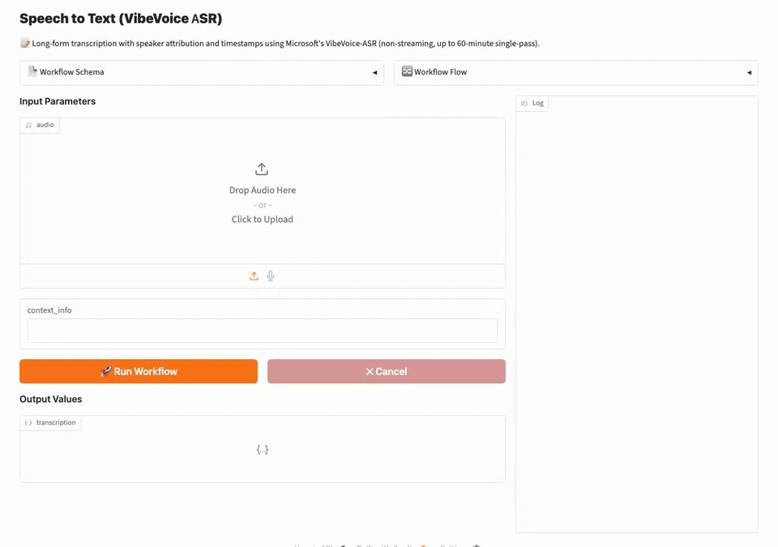
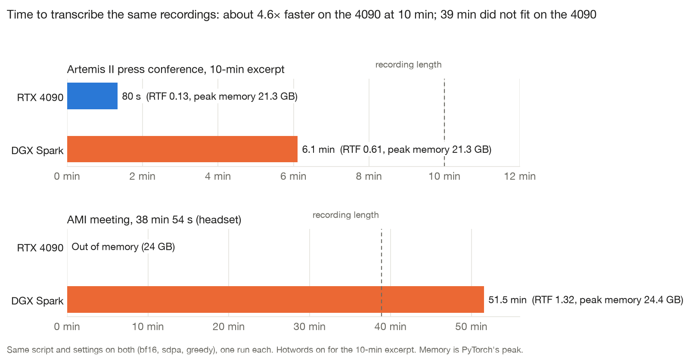
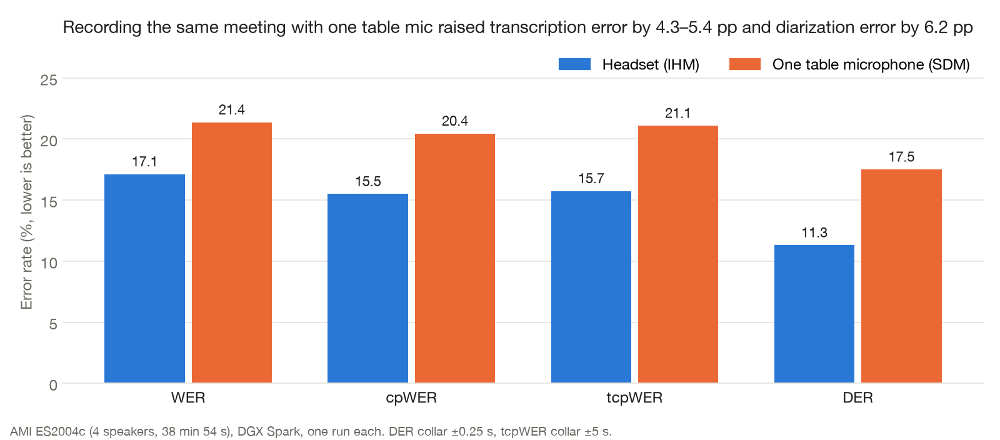
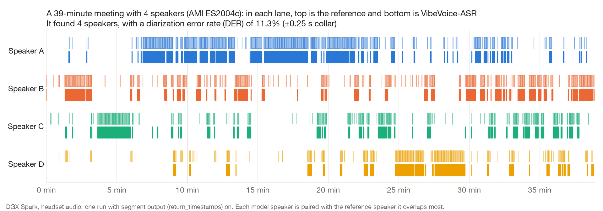
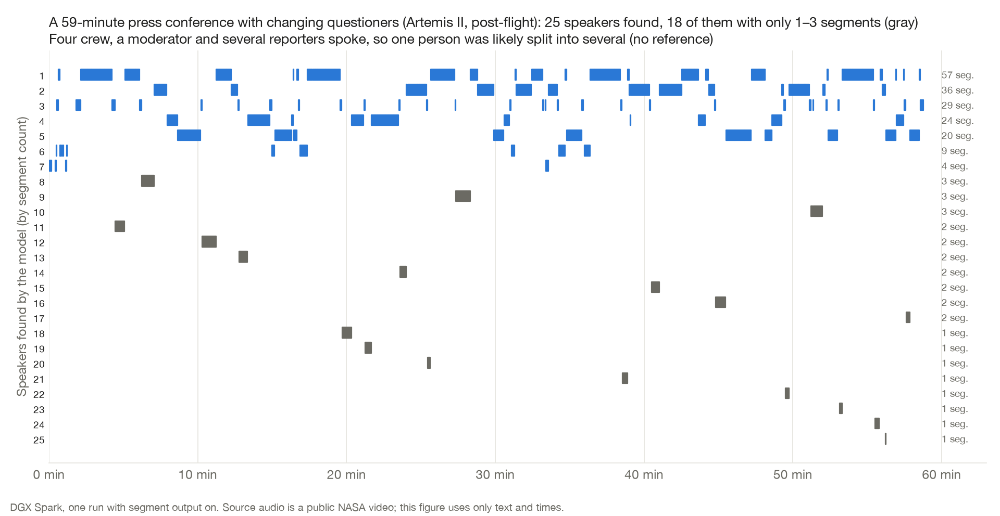
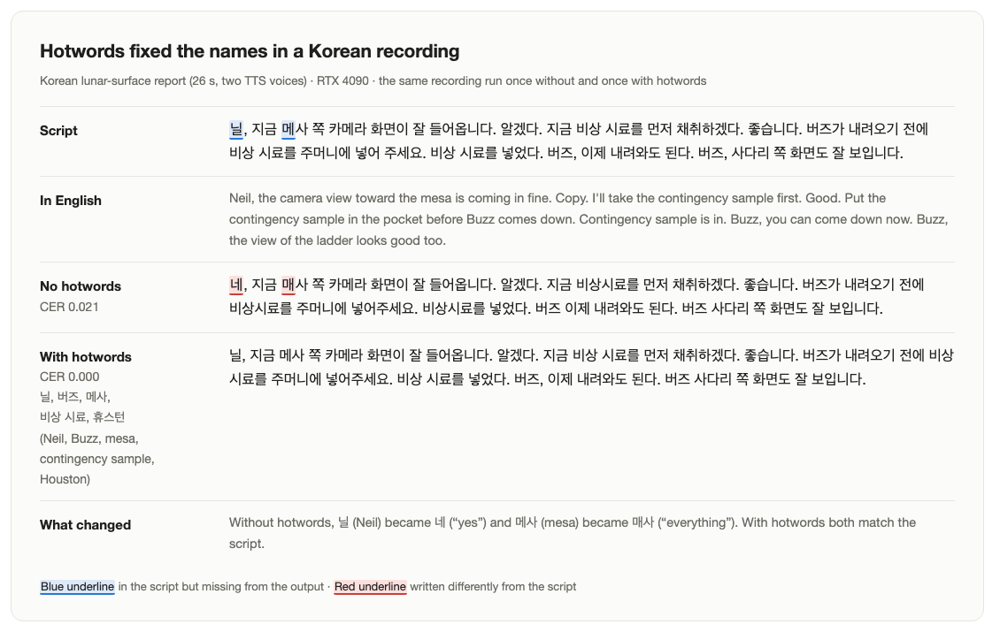
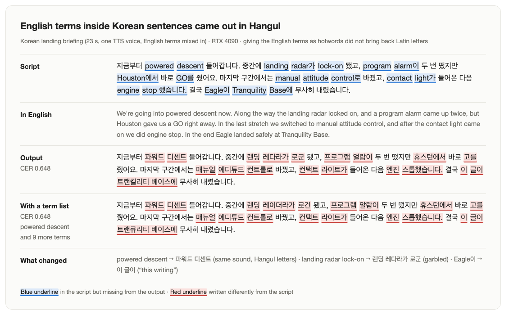
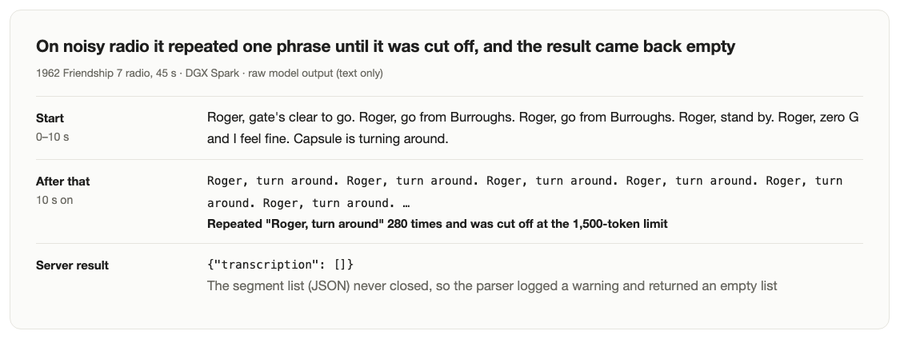
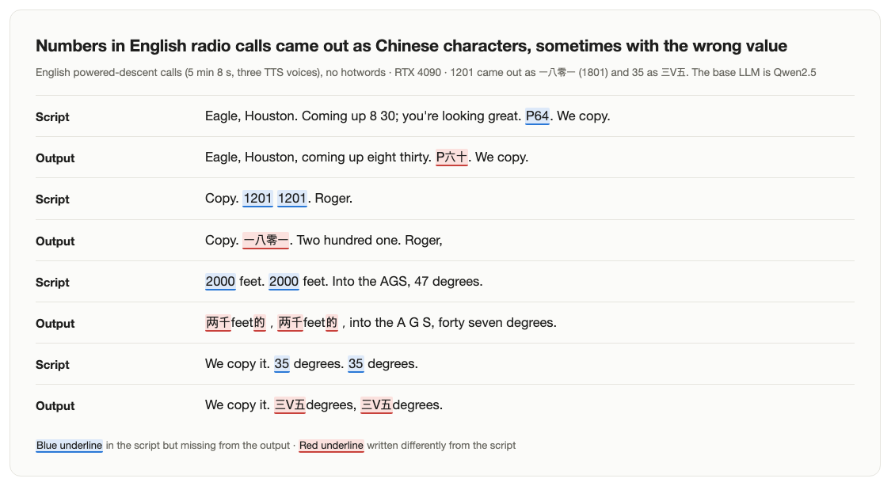
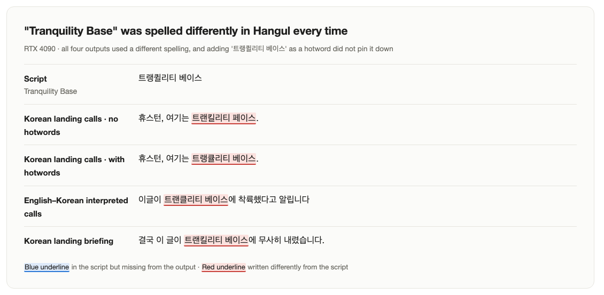

[English](README.md) · [한국어](README.ko.md) · [中文](README.zh-cn.md)

# speech-to-text-vibevoice

A speech recognition service: send a recording, get a transcript back. With enough memory, a meeting close to an hour long goes in whole, without cutting it into pieces.

We served Microsoft's VibeVoice-ASR (8.7B) with model-compose and ran it on an RTX 4090 and an NVIDIA DGX Spark. We asked whether it runs on our hardware and, if so, what it does well and badly. We did not compare it with other models. The original weights do not fit on an Apple M2 16GB, so we ran the same recordings there with a third-party 4-bit MLX conversion and compared the results with the original (Section 2). We also tested the streaming model, VibeVoice-ASR-Streaming (Section 3.6).

There were three kinds of input: Apollo 11 air-to-ground transcripts (NASA, public domain) read aloud by a TTS model, a public meeting recording (AMI), and NASA's public Artemis II press conference and 1962 radio recordings.

A language model drafted the verdicts by reading each output next to the reference script, one author confirmed them, and we also measured character error rate (CER) and word error rate (WER).



Demo: a 26-second recording (TTS) that alternates English radio calls and Korean interpretation, transcribed in the web UI (gradio). It took 5.4 s on an RTX 4090, shown at real speed. The server ran with the same settings as this repo's defaults (web UI, segment output).

## Contents

- [Quick start](#quick-start)
- [Summary](#summary)
- [1 Setup](#1-setup)
- [2 Does it run on my hardware?](#2-does-it-run-on-my-hardware)
  - [A 16 GB Mac runs it in 4-bit](#a-16-gb-mac-runs-it-in-4-bit)
- [3 Results by feature](#3-results-by-feature)
  - [3.1 60-minute single pass](#31-60-minute-single-pass)
  - [3.2 Speaker diarization and timestamps](#32-speaker-diarization-and-timestamps)
  - [3.3 Hotwords](#33-hotwords)
  - [3.4 Recognition without a language setting](#34-recognition-without-a-language-setting)
  - [3.5 Code-switching](#35-code-switching)
  - [3.6 The streaming model (VibeVoice-ASR-Streaming)](#36-the-streaming-model-vibevoice-asr-streaming)
- [4 Recommendations](#4-recommendations)
- [5 Limits and what we did not measure](#5-limits-and-what-we-did-not-measure)
- [License](#license)

## Model

[`microsoft/VibeVoice-ASR`](https://huggingface.co/microsoft/VibeVoice-ASR) is a speech recognition model that transcribes a recording and also says who spoke (speaker) and when (timestamps). The weights are 17.3 GB.
It compresses speech to 7.5 tokens per second and feeds it to an LLM (based on Qwen2.5), so it can take up to 60 minutes of audio in one pass. It supports over 50 languages and takes no language setting.

## Quick start

You need [model-compose](https://github.com/hanyeol/model-compose): `pip install model-compose`.

Start it from one config file (`model-compose.yml`):

```bash
model-compose up
```

Once the model loads, a web UI opens at `http://localhost:8102`. Upload a recording and you get a segment list with speaker numbers and times. The HTTP API is at `http://localhost:8101/api`. To change ports, copy `.env.sample` to `.env` and edit `PORT` and `SERVER_PORT`. The first start installs torch, which takes from a few minutes to tens of minutes (that is why the config sets `start_timeout: 30m`).

Example request:

```bash
curl -o out.json localhost:8101/api/workflows/runs \
  -F workflow_id=transcribe -F wait_for_completion=true -F output_only=true \
  -F "input.audio=@meeting.wav" \
  -F "input.context_info=Tranquility Base, Eagle"
```

`context_info` is a list of names and terms (hotwords) and may be empty. The result is a segment list (`{text, start_time, end_time, speaker_id}`). The report measured with transcript-only output (`return_timestamps: false`, workflow output `${output as text}`); only the speaker and time results in Section 3.2 were measured with segment output on.

**Running the streaming model.** Change four things in `model-compose.yml` and the result flows out chunk by chunk (Section 3.6).

- Set the component's `model` to `microsoft/VibeVoice-ASR-Streaming-7B`
- Set the workflow output to `${output as stream/text}`
- Set the action's `return_timestamps` to `false`
- Set the action's `streaming` to `true`

The request is the same as above; add `-N` to curl to print chunks as they arrive.

**On a 16 GB Mac.** The original weights (17.3 GB) do not fit on a 16 GB Mac. Run the third-party 4-bit conversion [`mlx-community/VibeVoice-ASR-4bit`](https://huggingface.co/mlx-community/VibeVoice-ASR-4bit) (5.7 GB) directly with [mlx-audio](https://github.com/Blaizzy/mlx-audio); model-compose has no MLX driver. mlx-audio pins a pre-release transformers, so it gets its own virtual environment (needs [uv](https://docs.astral.sh/uv/)).

```bash
uv venv .venv-mlx --python 3.12
uv pip install --python .venv-mlx/bin/python --prerelease=allow "mlx-audio==0.3.0"
.venv-mlx/bin/mlx_audio.stt.generate --model mlx-community/VibeVoice-ASR-4bit \
  --audio meeting.wav --output-path out --format json
```

`out.json` holds the segment list with speaker numbers and times. Pass hotwords with `--context "Tranquility Base, Eagle"`.

## Summary

1. On the RTX 4090, a 9-minute recording took 1 min 40 s (RTF 0.18) and a 19-minute one took 4 min 13 s (RTF 0.22), using 17–23 GB of GPU memory. A 39-minute meeting did not fit in 24 GB.
2. Running the same 10-minute recording with the same script, the 4090 took 80 s and the DGX Spark 367 s, so the 4090 was about 4.6× faster. The original weights do not fit on a 16 GB Mac, but the 4-bit conversion transcribed the same recording in 7 min 9 s, and its text matched the original's by 98%. It did, however, miss 5 of 20 short Korean sentences entirely.
3. On the DGX Spark, it transcribed a 59-minute recording end to end without cutting it (it took 86 minutes). In a 39-minute meeting with 4 speakers (AMI), it got the number of speakers right; WER was 17.1% with headset audio and 21.4% with a single table microphone.
4. Hotwords worked well for Korean names and places. CER fell from 0.021 to 0.000 on a lunar-surface report and from 0.056 to 0.016 on landing calls. English radio calls barely changed: English names and places were already right without hotwords, and the wrong numbers and acronyms were not fixed by hotwords.
5. Without being told the language, it wrote Korean, English and Japanese in their own scripts, and it followed a recording that switched between Korean and English line by line. But English terms inside Korean sentences came out as Hangul transliterations, such as "파워드 디센트" (pawodeu disenteu, for "powered descent"), and giving the terms as hotwords did not change that.
6. Some numbers in English radio calls came out as Chinese characters, such as "P六十" and "一八零一".
7. On old radio recordings where speech and noise mix, it repeated one phrase until the output was cut off, and in that case the server returned an empty result with no error. On noise-only recordings it did not make up sentences; it only emitted tags such as `[Noise]`.
8. The streaming model started streaming text within 0.7–2.3 s. On a real meeting it separated 4 speakers with accuracy close to the non-streaming model, but it merged the four TTS voices of a radio-call recording into one speaker.

Table 1: Summary by device

| Device | Runs? | Same 10-min recording | Peak memory |
|---|---|---|---|
| Apple M2 16GB | The original does not fit. Runs with a 4-bit conversion | 7 min 9 s (RTF 0.71, 4-bit) | 11.4 GB (with swap) |
| RTX 4090 24GB | Up to 19 min. 39 min ran out of memory | 1 min 20 s (RTF 0.13) | 21.3 GB |
| DGX Spark | Up to 59 min | 6 min 7 s (RTF 0.61) | 21.3 GB (28.1 GB at 59 min) |

The same 10-minute recording is an excerpt of the Artemis II press conference, run once on each device. The 4090 and DGX ran the original with the same script, and their memory is PyTorch's peak. The Mac ran the 4-bit conversion with mlx-audio without hotwords, and its memory is MLX's peak. The 4090 and DGX runs used hotwords, but on the DGX hotwords barely changed the time (366.6 s vs. 369.3 s).

## 1 Setup

Table 2: Devices

| Device | Accelerator | Memory | Conditions |
|---|---|---|---|
| RTX 4090 workstation | 1× RTX 4090 | 24 GB | Shared. Measured through a model-compose server when nothing else was running. Only the 10-minute device-comparison recording used the same script as the DGX |
| DGX Spark | GB10 | 120 GB unified | Shared. Measured once per condition with a script that calls transformers directly |
| MacBook (Apple M2) | GPU (Metal, MLX) | 16 GB unified | Measured with other apps open; 8–10 GB of swap was already in use |

- Weights: `microsoft/VibeVoice-ASR` revision `d0c9efdb`, bf16, sdpa attention, greedy decoding (temperature 0, beam 1).
- The Mac alone ran the third-party 4-bit conversion `mlx-community/VibeVoice-ASR-4bit` (revision `a1a15cb6`) with mlx-audio 0.3.0 (mlx 0.32.3). Its times come from a script that loads the model once, so loading (about 5 s) is excluded. Only the Korean-sentence and silence/noise tests went through the model-compose server (0.4.109), with the same script wrapped in a shell component.
- On the 4090, we started a server with model-compose 0.4.109 and sent requests. The first request after startup (warmup) and model loading (about 23 s) are not counted. The 19-minute recording ran without warmup, since warmup would only have run the same recording once more.
- The DGX numbers and the 4090 device-comparison numbers were measured by loading the model directly with the same script; memory is PyTorch's peak. The 4090 VRAM in Table 3 is whole-GPU usage, so do not mix it with these values.
- Inputs
  - 15 Apollo 11 recordings: NASA's 1969 transcripts (technical air-to-ground and public-affairs commentary) read by preset voices of Qwen3-TTS CustomVoice. No real astronaut's voice was used or imitated. The Korean and Japanese scripts are edited translations of the originals. We did not use VibeVoice-family TTS, since part of this model's training data is VibeVoice TTS output and that could flatter the results.
  - AMI meeting ES2004c (4 speakers, 38 min 54 s): public data that recorded the same meeting with headsets (IHM) and a single table microphone (SDM) at once.
  - The Artemis II post-flight press conference (public NASA video, 59 min 24 s) and its first 10 minutes as an excerpt.
  - 1962 Friendship 7 radio clips (public NASA audio, 45 s and 100 s) and noise recordings (silence, white, pink, radio band; 90 s each).
  - Mac only: 20 Korean read sentences from FLEURS (6–14 s each), as recorded and mixed with white noise at 5 dB SNR, twice each. Also 30 s of silence, 60 s of synthetic noise, and a read sentence followed by silence.
- Verdicts: a language model (Claude) read each output next to the reference script twice, independently, and drafted a verdict. It read text only and could not hear the audio. The author confirmed the drafts while listening; 93% of drafts (14 of 15) were kept as written.
- Scores: CER and WER are computed after removing punctuation, spaces and case. Number forms ("7" vs "seven") are not normalized, so English radio calls score worse than they really are. For English we therefore also report WER with both sides normalized by the Whisper English normalizer.

## 2 Does it run on my hardware?

Table 3: RTX 4090 processing time by recording length (one run each)

| Recording | Length | Processing time | RTF | Peak VRAM |
|---|---|---|---|---|
| Korean status report | 24.5 s | 2.7 s | 0.11 | 17.3 GB |
| Korean status report | 1 min 21 s | 10.0 s | 0.12 | 21.5 GB |
| English launch calls | 2 min 23 s | 22.4 s | 0.16 | 21.4 GB |
| English powered-descent calls | 5 min 8 s | 39.7 s | 0.13 | 21.6 GB |
| English landing calls | 9 min 6 s | 1 min 40 s | 0.18 | 22.6 GB |
| English first-EVA calls | 18 min 58 s | 4 min 13 s | 0.22 | 21.6 GB |

**RTF.** Processing time divided by recording length. Below 1 means it finishes faster than listening to the recording. The model writes the transcript one token at a time, and the longer the recording, the more input each new token has to attend to, so RTF grows. The 9-minute recording took 100 s and the 19-minute one 253 s: about twice the length, 2.5 times the time.

- Hotwords barely changed processing time (English descent calls: 39.7 s → 39.1 s).
- The 4090 (24 GB) fit recordings up to 19 minutes. The 39-minute AMI meeting (24.4 GB on the DGX) ran out of memory 14 s after it started, using the same script as the DGX. We did not measure between 19 and 39 minutes.

Table 4: DGX Spark processing time by recording length (direct call, one run each)

| Recording | Length | Processing time | RTF | Peak memory |
|---|---|---|---|---|
| Artemis II press conference, excerpt | 10 min | 6 min 7 s | 0.61 | 21.3 GB |
| AMI meeting (table mic) | 38 min 54 s | 50 min 36 s | 1.30 | 24.4 GB |
| AMI meeting (headset) | 38 min 54 s | 51 min 30 s | 1.32 | 24.4 GB |
| Artemis II press conference, full | 59 min 24 s | 85 min 36 s | 1.44 | 28.1 GB |

- On the DGX, the 10-minute recording finished faster than real time, and the 39- and 59-minute recordings took longer than the recordings themselves. We did not measure the lengths in between, so we do not know where it crosses over.

**Same-file comparison.** Tables 3 and 4 use different recordings and different measurement methods, so they cannot be compared across devices. We therefore ran two of the DGX recordings on the 4090 as well, once each, with the same script and settings.



Figure 1: Time to transcribe the same recordings on both devices.

- The 10-minute excerpt took 80 s on the 4090 and 367 s on the DGX, about 4.6× faster. Generated tokens per second were 41.5 vs 8.9.
- The 39-minute meeting ran out of memory on the 4090 14 s after it started. On the DGX it used 24.4 GB and took 51 min 30 s.
- Peak memory for the 10-minute excerpt was 21.3 GB on both. The transcripts were 98% the same (1,986 vs 1,983 words), so switching devices barely changed what it wrote.
- On the same 4090, this 10-minute recording (RTF 0.13) was faster than the 9-minute TTS calls in Table 3 (0.18). Both the content and the method (script vs model-compose server) differ, so we could not separate the cause; do not mix the values in Table 3 and Figure 1.

### A 16 GB Mac runs it in 4-bit

The 4-bit MLX conversion of the weights is 5.7 GB (the original is 17.3 GB). With it, we transcribed three recordings that the original had also processed and set the results side by side.

Table 5: Apple M2 16GB in 4-bit vs. the original (one run each)

| Recording | Length | Mac time | Mac peak memory | Speakers (truth / original / Mac) | WER original | WER Mac |
|---|---|---|---|---|---|---|
| AMI meeting (headset), 19:00–20:00 | 1 min | 1 min 28 s (RTF 1.47) | 7.7 GB | 4 / 4 / 2 | 0.301 | 0.277 |
| AMI meeting (headset), 19:00–24:00 | 5 min | 5 min 18 s (RTF 1.06) | 9.6 GB | 4 / 4 / 4 | 0.229 | 0.230 |
| Artemis II press conference excerpt | 10 min | 7 min 9 s (RTF 0.71) | 11.4 GB | no reference / 9 / 10 | - | 2% different from the original |

All original values are DGX results. The two AMI rows cut the same window out of a single pass over the whole meeting (39 min), and WER is measured as in Section 3.6. The 10-minute excerpt has no reference transcript, so we measured how much the Mac's words differ from the original's DGX output under the same condition (no hotwords). Mac times exclude model loading.

- **The transcripts were nearly the same as the original's.** The 10-minute excerpt was 1,995 vs. 2,009 words, 98% the same. AMI 5 min had WER 0.230 vs. 0.229. For the English meeting and press conference, going to 4-bit barely changed the results.
- **Speaker separation wobbled on a short clip.** On AMI 1 min it merged 4 speakers into 2. On the 5-minute window with the same 4 people, it separated all 4, like the original. On the 10-minute excerpt the original found 9 speakers and the Mac 10.
- **Short recordings were slower than real time.** The 1-minute clip took 1.5× its length. RTF fell as recordings got longer: 5 minutes took about as long as the recording, and 10 minutes finished in 7 min 9 s, faster than the recording. Without hotwords, the DGX took 6 min 9 s on the same 10 minutes (the 4090 only has a run with hotwords: 1 min 20 s).
- **Memory grew from 7.7 GB to 11.4 GB with recording length.** 8–10 GB of swap was in use during the runs. Closing other apps may make it faster.

**Short Korean sentences.** We sent 20 Korean read sentences from FLEURS to the model-compose server twice each. Both runs gave identical results.

Table 6: FLEURS Korean, 20 sentences (Mac, 4-bit)

| Condition | Transcribed | Missed entirely | CER of transcribed sentences (median / mean) | Exactly right |
|---|---|---|---|---|
| Clean | 15 | 5 | 0.000 / 0.029 | 8 |
| White noise, 5 dB SNR | 13 | 7 | 0.222 / 0.328 | 0 |

- **Transcribed sentences were mostly accurate.** 8 of the 15 clean sentences had no errors apart from spacing and punctuation. Most errors were in foreign proper nouns ("카사블랑카" Casablanca → "가사 블랑카", "듀발" Duval → "쥐발", "피히테" Fichte → "피히트의"). The worst sentence wrote "플리트비체 호수 국립공원은" (Plitvice Lakes National Park) as "플리프 빛의 호소 공익공원은" (CER 0.189).
- **A missed sentence came back as a single `[Silence]` or `[Music]` tag.** These were read sentences of 8–14 s, and loudness did not explain it: one missed sentence was louder than most of the transcribed ones. Two missed sentences gave the same result when fed to the script directly, without model-compose. We did not run these 20 sentences on the original, so we do not know whether 4-bit is the cause.
- **Noise made it much worse.** Missed sentences rose to 7, and the 13 transcribed ones had a median CER of 0.222. "낭만주의는" (Romanticism) became "남만주 의", and the Plitvice sentence turned into an unrelated one.
- **It did not invent speech from silence or noise.** 30 s of silence and 60 s of synthetic noise each produced a single `[Silence]`. A read sentence followed by silence was transcribed and then followed only by `[Silence]`. This matches the original's noise test (Section 5).

## 3 Results by feature

Table 7: Features the official materials highlight

| Official feature | Our result |
|---|---|
| 60-minute single pass | Transcribed 19-minute (4090) and 59-minute (DGX) recordings end to end without cutting them. The 4090 (24 GB) ran out of memory on a 39-minute recording. |
| Speaker diarization and timestamps | Got the speaker count right in a 4-person meeting, with DER 11.3% (headset). A press conference with changing questioners was split into 25 speakers. |
| Custom hotwords | Korean names and places were fixed; English numbers and acronyms barely changed. |
| 50+ languages, no language setting | Wrote Korean, English and Japanese in their own scripts. Japanese had more errors, with CER 0.169. |
| Code-switching | Followed recordings that switch language line by line; English terms inside Korean sentences were transliterated into Hangul. |
| Streaming (separate checkpoint) | First text came within 1–2 s, and it separated the 4 speakers of a real meeting. It merged four TTS voices into one speaker. |

### 3.1 60-minute single pass

> Official GitHub: "VibeVoice ASR accepts up to 60 minutes of continuous audio input within 64K token length."

- **4090, 18 min 58 s EVA calls:** went in whole and was transcribed to the end. The output starts with "Okay, Houston, I'm on the porch.", passes through "That's one small step for man, one giant leap for mankind." and ends with "We've got this view, Neil." No phrase was repeated.
- **DGX, 59 min 24 s Artemis II post-flight press conference:** 230 segments and about 10,800 words, with the last segment running to the end of the recording (59:23). Music and room noise at the start and end were tagged separately as `[Music]` and `[Environmental Sounds]`. Peak memory was 28.1 GB.
- **4090, 38 min 54 s AMI meeting:** ran out of memory right after it started. Putting a recording close to 60 minutes through in one pass needs more than 24 GB of memory.

### 3.2 Speaker diarization and timestamps

The 4090 runs were set to return only the transcript text, so they did not measure speakers or times. The results below come from the DGX with segment output on.

Table 8: AMI meeting ES2004c (4 speakers, 38 min 54 s), recorded with two kinds of microphone at once.

| Metric (%, lower is better) | Headset | Table mic | Paper, headset | Paper, table mic |
|---|---|---|---|---|
| WER (word error rate) | 17.12 | 21.37 | 18.81 | 24.65 |
| cpWER (WER grouped by speaker) | 15.50 | 20.45 | 20.41 | 28.82 |
| tcpWER (WER that also requires the right time, ±5 s) | 15.74 | 21.09 | 20.82 | 29.80 |
| DER (diarization error, ±0.25 s collar) | 11.31 | 17.51 | 11.92 | 13.43 |
| Speaker count (reference 4) | 4 | 4 | - | - |



Figure 2 (DGX): Error rates for the same meeting recorded with different microphones.

- In a meeting where the same 4 people talked for all 39 minutes, both microphones got the speaker count right. tcpWER was only 0.2–0.6 pp above cpWER, so the times were mostly right too.



Figure 3 (DGX): Speaker timeline of the 39-minute AMI meeting. For each speaker, the top lane is the reference and the bottom lane is the model's segments.

- With a single table microphone, WER rose by 4.3 pp and DER by 6.2 pp. That is close to recording a meeting with one laptop or phone.
- In the 59-minute press conference with changing questioners, it found 25 speakers. 18 of them have only 1–3 segments, so it likely split the same person into several (there is no reference).



Figure 4 (DGX): Artemis II post-flight press conference, 59 minutes. Speakers found by the model, ordered by segment count. Gray marks speakers with only 1–3 segments.

- The paper's numbers cover a whole test set and ours a single meeting, so read them only as the same ballpark. DER nearly doubles depending on the collar (20.25% with no collar). AMI is widely used public data, so we cannot rule out that it was in the pretraining data.

### 3.3 Hotwords

> Model card: "Users can provide customized hotwords (e.g., specific names, technical terms, or background info) to guide the recognition process, significantly improving accuracy on domain-specific content."

We ran each recording once without and once with hotwords.



Figure 5 (4090): Before and after hotwords. Differences in spacing and commas are not marked, matching how scores are computed.

Table 9: Score changes with and without hotwords (4090)

| Recording | Hotwords | CER | WER |
|---|---|---|---|
| Korean lunar-surface report | 닐, 버즈, 메사, 비상 시료, 휴스턴 (Neil, Buzz, mesa, contingency sample, Houston) | 0.021 → **0.000** | 0.278 → 0.056 |
| Korean landing calls | 이글, 컬럼비아, 트랭퀼리티 베이스, 프로그램 알람, 동력 하강 (Eagle, Columbia, Tranquility Base, program alarm, powered descent) | 0.056 → **0.016** | 0.184 → 0.053 |
| English powered-descent calls | Eagle, Columbia, Tranquility Base, DELTA-H, PGNS, AGS, P64 | 0.387 → 0.390 | 0.376 → 0.357 |

Measured again with WER that also normalizes number forms, the English descent calls went from 22.6% to 20.3%, a small drop.

- **In the Korean lunar-surface report, hotwords got every name right.** Without them, "닐, 지금 메사 쪽" ("Neil, toward the mesa now") came out as "네, 지금 매사 쪽" ("Yes, now everything …"). With hotwords, "닐" (Neil) and "메사" (mesa) matched the script. "버즈" (Buzz) and "비상 시료" (contingency sample) were already right without hotwords (only the spacing differed, "비상시료").
- **The Korean landing calls were only partly fixed.** "슈스턴" became "휴스턴" (Houston) and "콜럼비아" became "컬럼비아" (Columbia), but "트랭퀼리티 베이스" (Tranquility Base), which was on the list, came out as "트랭큘리티 베이스".
- **The English descent calls barely changed.** "Eagle" (9 times) and "Tranquility Base" already matched the script without hotwords, so there was nothing to fix. The errors were in numbers and acronyms. "Both odd" (both AUTO) and "Fuel stand is in" (413 is in) were the same with or without hotwords. Among the listed acronyms, "AGS" became correct, and "P64" was right in only one of two places (the other was "P六十" without hotwords and "P60" with them).
- Hotwords did not increase processing time.

### 3.4 Recognition without a language setting

> Model card: "It supports over 50 languages, requires no explicit language setting, and natively handles code-switching within and across utterances."

Table 10: Scores by language (4090, no language setting)

| Recording | CER | WER |
|---|---|---|
| Korean, one-speaker report | 0.025 | 0.240 |
| Korean, two-speaker exchange | 0.000 | 0.000 |
| English status report | 0.004 | 0.045 |
| Japanese, one-speaker report | 0.169 | 0.909* |

\* The reference has no spaces between words, so do not read this as a word-level metric.

- **Nothing was translated or written in the wrong script.** Korean came out in Hangul, English in Latin letters, and Japanese in hiragana, katakana and kanji.
- **Japanese was recognized as Japanese, but with many word errors.** "アポロ管制センター" (Apollo control center) came out as "アポロ厳正センター", and "乗組員" (crew) as "ノグミン".
- The Korean script's "이십일 시간 삼십팔 분" (twenty-one hours thirty-eight minutes, spelled out) came out in digits, "21시간 38분". The same countdown came out as "10, 9, 8" in one run and "Ten, nine, eight" in another, so number forms are not consistent.
- We checked only Korean, English and Japanese. Of the training data, 66.7% is English, 14.4% Chinese and 0.9% Korean (paper appendix).

### 3.5 Code-switching

Table 11: Code-switching recordings (4090)

| Recording | CER | Result |
|---|---|---|
| English original and Korean interpretation alternating line by line | 0.010 | Wrote English lines in English and Korean lines in Hangul, in order. Only "트랭퀼리티 베이스" (Tranquility Base) was wrong, as "트랜클리티 베이스" |
| English terms inside Korean sentences | 0.648 | Every English term was transliterated into Hangul, and some changed meaning |

English terms inside Korean sentences came out like this.

| Script | Output |
|---|---|
| powered descent | 파워드 디센트 (pawodeu disenteu) |
| landing radar가 lock-on 됐고 | 랜딩 레다라가 로군 됐고 (garbled) |
| program alarm | 프로그램 얼람 (peurogeuraem eollam) |
| Houston에서 바로 GO를 줬어요 | 휴스턴에서 바로 고를 줬어요 ("go" in Hangul) |
| Eagle이 Tranquility Base에 | 이 글이 트랜킬리티 베이스에 ("this writing" … Tranquility Base) |



Figure 6 (4090): Code-switching briefing. The bottom row is the follow-up run with the English terms given as hotwords.

**Follow-up: does a term list keep the terms in English?** We ran the same recording again with "Eagle, Tranquility Base, powered descent, landing radar, lock-on, program alarm, GO, manual attitude control, contact light, engine stop" as hotwords. Still not one term came out in Latin letters, and CER stayed at 0.648. Only the spellings shifted a little ("레다라가 로군" → "레이더라가 로건", "얼람" → "알람"). In sentences that are mainly Korean, a term list could not change which script the terms were written in. We did not measure the opposite direction (Korean words inside English sentences).

### 3.6 The streaming model (VibeVoice-ASR-Streaming)

> Technical report: "produce 'who said what' as speech arrives, without a separate diarization stage."

The streaming model listens to the recording in chunks (2.9 s) and emits text as it goes. In model-compose, setting the workflow output to `${output as stream/text}` and the action to `streaming: true` makes the result flow out chunk by chunk. We ran the 7B (revision `60d858b5`) once each on four recordings (RTX 4090).

Table 12: Streaming 7B (4090, one run each)

| Recording | Actual speakers | Streaming speakers | First text | Done | WER streaming | WER non-streaming |
|---|---|---|---|---|---|---|
| English EVA calls, 2 min 47 s (TTS, 4 voices) | 4 | 1 | 1.8 s | 17.2 s | 0.035 | 0.023 |
| AMI meeting, 1 min (19:00–20:00) | 4 | 4 | 0.7 s | 9.3 s | 0.225 | 0.301 |
| AMI meeting, first 5 min | 4 | 4 | 2.3 s | 24.7 s | 0.182 | 0.159 |
| AMI meeting, 19:00–24:00 | 4 | 4 | 2.0 s | 45.1 s | 0.211 | 0.229 |

These WERs only normalize punctuation and case, so do not compare them directly with WERs in other tables. For non-streaming, AMI uses the same stretch of the 39-minute one-pass transcript (DGX), and EVA uses the 4090 measurement.

- **Results streamed right away.** The first text arrived in 0.7–2.3 s, and a 5-minute recording finished in 25–45 s (RTF 0.08–0.15). Given a file, it streams out as fast as it can rather than at the recording's pace. We did not test live input such as a microphone.
- **On real meetings it separated the speakers.** All three AMI stretches came out with 4 speakers. Speaker labels come inline in the text, like "Speaker 1:", and there are no timestamps.
- **Accuracy was close to the non-streaming model.** AMI WER was 0.18–0.23, close to the non-streaming result for the same stretches (0.16–0.30).
- **It merged the four TTS voices into one speaker.** The transcription was accurate (WER 0.035), but every line was Speaker 0. We did not check why it separated real people but not the TTS voices.
- We did not measure the 1.5B.

## 4 Recommendations

- **Hardware:** A 24 GB GPU handles recordings of about 20 minutes, but a 39-minute meeting ran out of memory. Run longer recordings on a device with more memory (28.1 GB at 59 minutes). On the DGX Spark, from 39 minutes on, processing took longer than the recording, and the 4090 finished the same recording about 4.6× faster.
- **16 GB Mac:** The 4-bit conversion (mlx-audio) runs, and on a 10-minute English recording it produced nearly the same text as the original in a little over 7 minutes. It works for transcribing recordings ahead of time but is too slow for live captions. Short Korean recordings can come back entirely empty (`[Silence]`), so when that happens, listen to the recording again before trusting it.
- **Meeting notes:** If you need speakers, get segment output with `return_timestamps: true`. A meeting recorded with a single laptop has about 4 pp higher WER than with headsets, and speaker attribution is shakier.
- **Hotwords:** Put names, places and in-house terms in hotwords. They did not add processing time and fixed Korean proper nouns. English numbers and acronyms (calls like P64 and AGS) were not reliably fixed, so have a person check them.
- **Code-switching:** If you need English terms in Korean speech written in English, keep a separate dictionary that maps the transliterations back ("파워드 디센트" → "powered descent"). This model did not write them in Latin letters even with a term list.
- **Numbers:** The same number can come out as Arabic digits, English words or Chinese characters. Normalize them in post-processing when numbers matter, and normalize number forms before measuring accuracy.
- **Streaming:** When you need results right away, such as live captions during a meeting, use the streaming model. On the 4090 the first text came within 1–2 s and it separated the speakers of a real meeting. When you need the time of each line, give the non-streaming model the whole recording.
- **Old radio and noisy recordings:** A repetition loop can leave the result completely empty (Section 5). Do not read an empty result as "nobody spoke"; check the raw output, or set a token limit and a repetition check.

## 5 Limits and what we did not measure

### Repetition loops and silent empty results

Two 1962 Friendship 7 radio clips (45 s and 100 s) came back empty. The model did hear the speech: the start of the raw output was correct.

> Fifteen seconds. Godspeed, John Glenn. Ten, nine, eight, seven.

After that, in a noisy stretch, it repeated one phrase over and over ("Roger, turn around. Roger, turn around. …"). When the output is cut off at the token limit, the segment list (JSON) never closes, and the VibeVoice package's parser logs a warning and returns an empty list. A user can easily take that to mean "nobody spoke".



Figure 7 (DGX): Repetition loop and empty result.

Table 13: Variables we changed (DGX)

| Variable | Values | Result |
|---|---|---|
| Hotwords | none; on (Friendship 7, Glenn, Cape Canaveral, …) | All 4 runs looped |
| Clip | 45 s, 100 s | Both correct at the start, looping later |
| Token limit | 1,500 | All 4 runs generated up to the limit, with no end token |
| Run path | model-compose server, direct call | Both empty |
| Input | noise only (silence, white, pink, radio band; 90 s each) | No loop. A single `[Silence]`, `[Noise]` or `[Environmental Sounds]` tag |
| Input | clean long recordings (AMI 39 min, press conference 59 min) | No loop, normal end |

With noise alone it did not make up sentences; the loops appeared when speech and noise were mixed. With a check that stops generation when the last 400 tokens repeat with a period of 100 tokens or less, these 4 runs were caught between 450 and 1,100 tokens, and the check never fired on normal output.

### Other limits

- **Most inputs are TTS recordings.** We saw real human speaking styles, overlapping speech and field noise only in the AMI meeting, the press conference and the 1962 radio. For overlapping speech, the paper itself says the model transcribes only the louder voice.
- **Chinese characters appeared in English radio calls.** "P64" became "P六十" and "1201" became "一八零一"; with hotwords, forms like "两千尺的" and "四十七 degrees" remained (Chinese characters only went from 20 to 15).



Figure 8 (4090): Chinese numerals in English radio calls. 1201 came out as 一八零一 (1801), so even the value was wrong.

- **"Tranquility Base" was spelled differently in Hangul every time.** All four outputs differed: "트랜킬리티 페이스", "트랭큘리티 베이스", "트랜클리티 베이스" and "트랜킬리티 베이스", and hotwords did not pin it down.



Figure 9 (4090): Four spellings of the same place name.

- **The same input twice gives nearly the same output.** A 1-minute Korean recording gave identical results both times, and a 3-minute English recording differed in one punctuation mark out of 394 words ("inch. But" vs "inch, but").
- **Each condition was measured once.** We do not know how much speed varies.
- **The Mac results come from a third-party 4-bit conversion.** We compared it with the original on three English recordings only, and did not check whether the original also misses whole Korean sentences. We measured with other apps open and swap in use, and did not test hotwords, code-switching or streaming on the Mac.
- **Not measured:** the other 47 of the 50+ languages (including Chinese), Korean words inside English sentences, the streaming 1.5B, live microphone input, the longest recording that fits on a 4090 (between 19 and 39 minutes), the speed of other inference engines such as vLLM, and a quantitative evaluation of overlapping speech.

## License

| Item | License | Commercial use |
|---|---|---|
| `microsoft/VibeVoice-ASR` weights | [MIT](https://huggingface.co/microsoft/VibeVoice-ASR/blob/main/LICENSE) | ✓ |
| `microsoft/VibeVoice-ASR-Streaming-7B` weights | [MIT](https://huggingface.co/microsoft/VibeVoice-ASR-Streaming-7B) | ✓ |
| Apollo 11 transcripts (input scripts) | U.S. federal government work, public domain | ✓ |
| [AMI Meeting Corpus](https://groups.inf.ed.ac.uk/ami/corpus/) | CC BY 4.0 | ✓ (with attribution) |
| Public NASA video and audio (Artemis II press conference, Friendship 7 radio) | U.S. federal government work. Used only for measurement and not included in this repository | ✓ |
| [Qwen3-TTS CustomVoice](https://huggingface.co/Qwen/Qwen3-TTS-12Hz-1.7B-CustomVoice) (input speech synthesis) | Apache 2.0 | ✓ |
| `mlx-community/VibeVoice-ASR-4bit` conversion (for Mac) | [MIT](https://huggingface.co/mlx-community/VibeVoice-ASR-4bit) | ✓ |
| [FLEURS](https://huggingface.co/datasets/google/fleurs) Korean (Mac test input) | CC BY 4.0. Used for measurement only, not included in this repo | ✓ (with attribution) |

- This project is released under the MIT License.
- Microsoft does not recommend using VibeVoice in commercial or real-world applications without further testing and development.
- Per NASA's media usage guidelines, we do not use the NASA logo or imply NASA endorsement. Script sources: [Apollo 11 Technical Air-to-Ground Voice Transcription](https://archive.org/download/Apollo11Audio/AS11_TEC.pdf), [Apollo 11 Mission Commentary](https://archive.org/download/Apollo11Audio/AS11_PAO.PDF).
