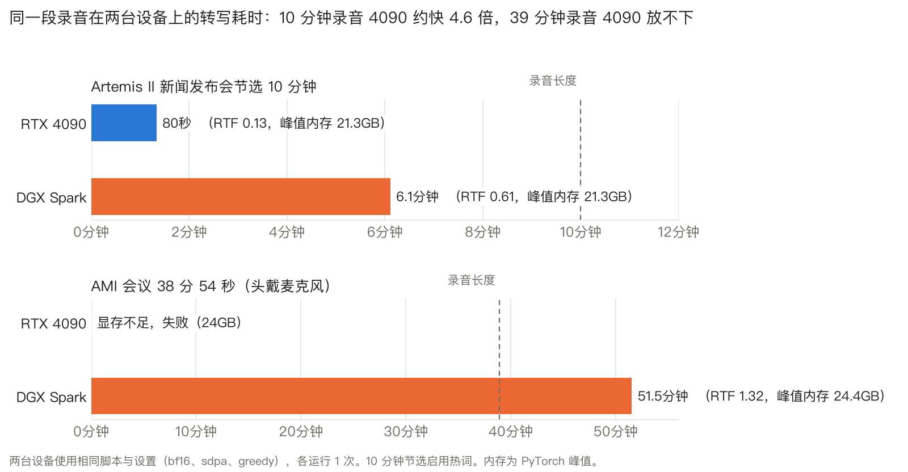
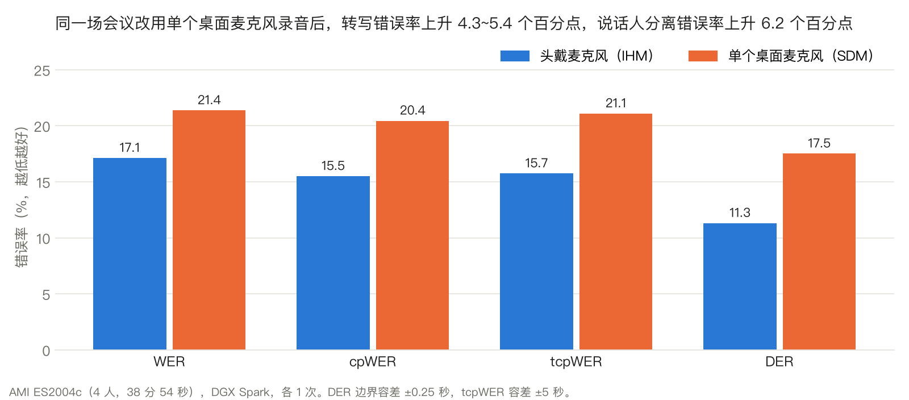
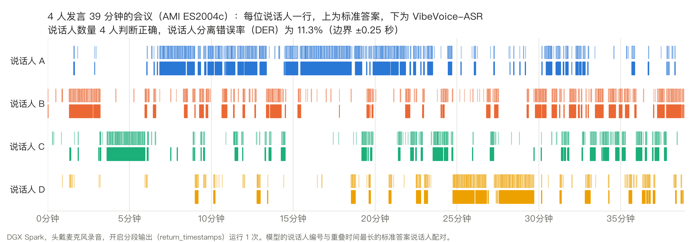
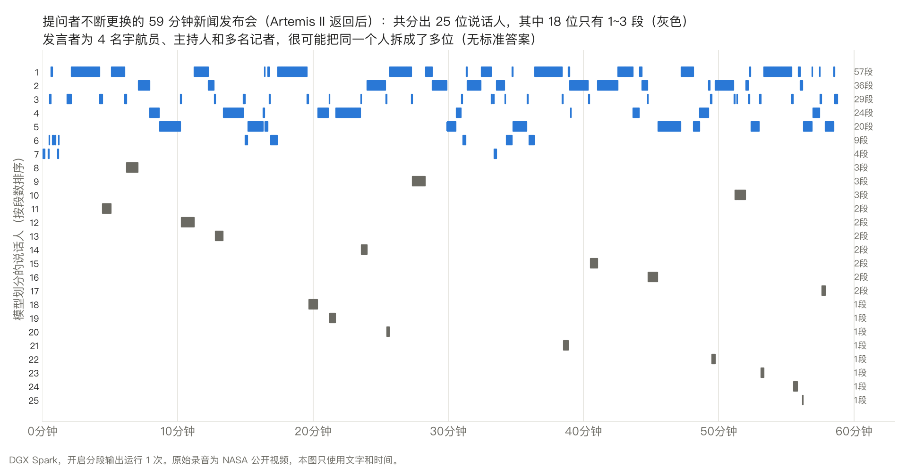
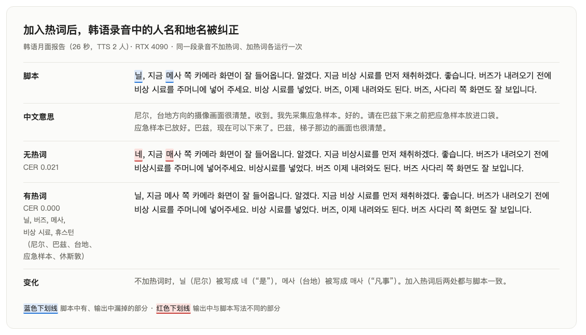
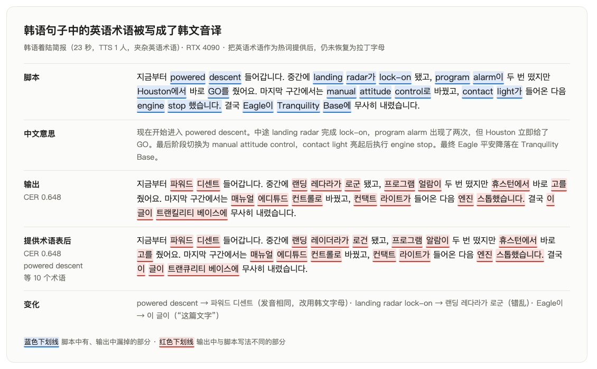
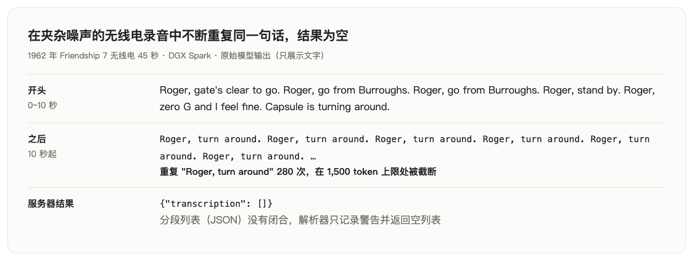
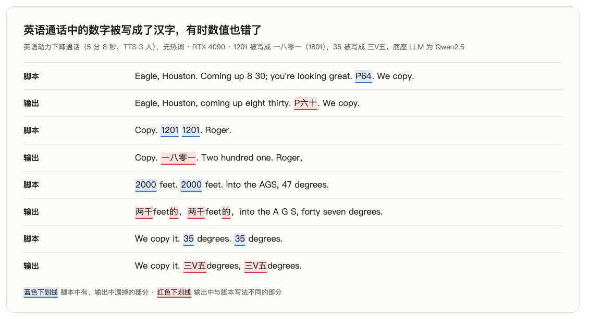

[English](README.md) · [한국어](README.ko.md) · [中文](README.zh-cn.md)

# speech-to-text-vibevoice

一个语音识别服务：传入录音文件，返回转写文字。内存足够时，接近一小时的会议也可以不切分、一次性传入。

我们用 model-compose 部署了 Microsoft 的 VibeVoice-ASR（8.7B），并在 RTX 4090 和 NVIDIA DGX Spark 上运行。我们关注的是这个模型能否在自己的设备上运行，以及能运行时擅长什么、不擅长什么，只在短朗读句子上与 Whisper large-v3 做了比较（第 3.4 节）。Apple M2 16GB 放不下原始权重，因此在上面用第三方 4 比特 MLX 转换版运行了同样的录音，并与原版比较（第 2 章）。另外也测试了流式版本 VibeVoice-ASR-Streaming（第 3.6 节）。

输入有三类：以 Apollo 11 真实通话记录（NASA，公有领域）为脚本、由 TTS 朗读的录音，公开会议录音（AMI），以及 NASA 公开的 Artemis II 新闻发布会和 1962 年无线电录音。为了让英语、韩语和中文读者都能找到自己语言的结果，我们还用三种语言运行了同一组朗读句子（FLEURS），并在每种语言上对热词、语码转换和数字做了同样的测试。

结果由语言模型对照标准脚本起草判定，再由作者 1 人确认，同时测量了字符错误率（CER）和词错误率（WER）。


演示：把英语通话与韩语口译交替出现的 26 秒录音（TTS）上传到网页 UI（gradio）进行转写。在 RTX 4090 上用时 5.4 秒，画面未加速。服务器使用与本仓库默认配置相同的设置（网页 UI、分段输出）。

## 目录

- [快速开始](#快速开始)
- [摘要](#摘要)
- [1 实验环境](#1-实验环境)
- [2 能在我的设备上运行吗](#2-能在我的设备上运行吗)
  - [16GB Mac 可以用 4 比特运行](#16gb-mac-可以用-4-比特运行)
- [3 各功能结果](#3-各功能结果)
  - [3.1 60 分钟单次处理](#31-60-分钟单次处理)
  - [3.2 说话人分离与时间戳](#32-说话人分离与时间戳)
  - [3.3 热词](#33-热词)
  - [3.4 各语言准确率（无需指定语言）](#34-各语言准确率无需指定语言)
  - [3.5 语码转换](#35-语码转换)
  - [3.6 流式版本（VibeVoice-ASR-Streaming）](#36-流式版本vibevoice-asr-streaming)
  - [3.7 数字](#37-数字)
- [4 建议](#4-建议)
- [5 局限与未测量的内容](#5-局限与未测量的内容)
- [许可证](#许可证)

## 模型

[`microsoft/VibeVoice-ASR`](https://huggingface.co/microsoft/VibeVoice-ASR) 是一个语音识别模型，在转写录音的同时还会给出谁在说话（说话人）以及何时说话（时间戳）。权重为 17.3GB。
它把语音压缩为每秒 7.5 个 token 后送入 LLM（基于 Qwen2.5），因此最长 60 分钟的录音无需切分即可一次处理。支持 50 多种语言，不需要指定语言。

## 快速开始

需要 [model-compose](https://github.com/hanyeol/model-compose)：`pip install model-compose`。

用一个配置文件（`model-compose.yml`）启动：

```bash
model-compose up
```

模型加载后会打开网页 UI（`http://localhost:8102`）。上传录音即可得到带说话人编号和时间的分段列表。HTTP API 在 `http://localhost:8101/api`。如需修改端口，把 `.env.sample` 复制为 `.env` 并修改 `PORT`、`SERVER_PORT`。首次启动需要安装 torch，耗时几分钟到几十分钟（这也是配置里设置 `start_timeout: 30m` 的原因）。

请求示例：

```bash
curl -o out.json localhost:8101/api/workflows/runs \
  -F workflow_id=transcribe -F wait_for_completion=true -F output_only=true \
  -F "input.audio=@meeting.wav" \
  -F "input.context_info=Tranquility Base, Eagle"
```

`context_info` 是专有名词和术语列表（热词），可以留空。结果为分段列表（`{text, start_time, end_time, speaker_id}`）。报告的测量使用只返回转写文字的设置（`return_timestamps: false`，工作流输出 `${output as text}`），只有第 3.2 节的说话人和时间结果是在开启分段输出时测得的。

**以流式版本启动。** 在 `model-compose.yml` 中改四处，结果就会按片段流出（第 3.6 节）。

- 把组件的 `model` 改为 `microsoft/VibeVoice-ASR-Streaming-7B`
- 把工作流输出改为 `${output as stream/text}`
- 把动作的 `return_timestamps` 改为 `false`
- 把动作的 `streaming` 改为 `true`

请求与上面相同；给 curl 加上 `-N`，片段一到就会显示。

**在 16GB Mac 上运行。** 16GB 的 Mac 放不下原始权重（17.3GB）。用 [mlx-audio](https://github.com/Blaizzy/mlx-audio) 直接运行第三方 4 比特转换版 [`mlx-community/VibeVoice-ASR-4bit`](https://huggingface.co/mlx-community/VibeVoice-ASR-4bit)（5.7GB）；model-compose 没有 MLX 驱动。mlx-audio 依赖预发布版 transformers，所以单独建一个虚拟环境（需要 [uv](https://docs.astral.sh/uv/)）。

```bash
uv venv .venv-mlx --python 3.12
uv pip install --python .venv-mlx/bin/python --prerelease=allow "mlx-audio==0.3.0"
.venv-mlx/bin/mlx_audio.stt.generate --model mlx-community/VibeVoice-ASR-4bit \
  --audio meeting.wav --output-path out --format json
```

`out.json` 中是带说话人编号和时间的分段列表。热词用 `--context "Tranquility Base, Eagle"` 传入。

## 摘要

以下结果除 4090 处理时间（各 3 次）外均为单次测量，输入大多是合成语音（TTS）或朗读。CER 相差 0.01~0.02 以内可视为噪声。

1. 24GB 的 RTX 4090 能处理最长 35 分钟的录音，39 分钟显存不足。把长录音连续发给同一个服务器时，30 分钟也会显存不足（[第 2 章](#2-能在我的设备上运行吗)）。
2. 同一段 10 分钟录音，4090 比 DGX Spark 快约 4.6 倍。16GB Mac 可以运行 4 比特转换版，转写文字与原版几乎相同，但速度更慢（[第 2 章](#2-能在我的设备上运行吗)）。
3. DGX Spark 一次性转写了 59 分钟录音，并正确判断出 4 人会议的说话人数（[3.1](#31-60-分钟单次处理)、[3.2](#32-说话人分离与时间戳)）。
4. 在同一组朗读句子上，英语最准确，其次是中文，最后是韩语。韩语和中文有时会整句漏掉。在同一组句子上指定语言的 Whisper large-v3 一句也没漏，在韩语和含噪声的录音上更准确（[3.4](#34-各语言准确率无需指定语言)）。
5. 热词纠正了韩语句子和英语句子中的韩国人名，但没能稳定地纠正英语数字和缩写（[3.3](#33-热词)）。
6. 韩语句子中的英语术语即使提供热词也被写成韩文音译；在中文句子中则保持为英语（[3.5](#35-语码转换)）。
7. 数字写法不统一：有时写成文字，有时写成阿拉伯数字，英语通话中甚至出现汉字（[3.7](#37-数字)）。
8. 在噪声较多的老旧无线电录音中，模型重复同一句话直到输出被截断，此时服务器不报错、直接返回空结果（[第 5 章](#5-局限与未测量的内容)）。
9. 流式版本在 0.7~2.3 秒内给出第一段文字，能分出真实会议的 4 位说话人，但把四种 TTS 音色归为了同一人（[3.6](#36-流式版本vibevoice-asr-streaming)）。

表 1：各设备摘要

| 设备 | 能否运行 | 同一段 10 分钟录音 | 峰值内存 |
|---|---|---|---|
| Apple M2 16GB | 放不下原版。用 4 比特转换版可以运行 | 7 分 9 秒（RTF 0.71，4 比特） | 11.4GB（发生交换） |
| RTX 4090 24GB | 可运行到 35 分钟。39 分钟显存不足 | 1 分 20 秒（RTF 0.13） | 21.3GB |
| DGX Spark | 可运行到 59 分钟 | 6 分 7 秒（RTF 0.61） | 21.3GB（59 分钟为 28.1GB） |

同一段 10 分钟录音是 Artemis II 新闻发布会的节选，在每台设备上各运行 1 次（测量方式与内存口径见表 3）。Mac 在无热词条件下运行。4090 和 DGX 的运行加了热词，但在 DGX 上有无热词的时间几乎相同（366.6 秒对 369.3 秒）。

表 2：各语言摘要

| | 英语 | 韩语 | 中文 |
|---|---|---|---|
| 朗读句子，干净录音（[3.4](#34-各语言准确率无需指定语言)） | 19 句漏掉 0 句，CER 0.009 | 20 句漏掉 3 句，CER 0.032 | 19 句漏掉 2 句，CER 0.025 |
| 朗读句子，噪声 5dB | 19 句漏掉 1 句，CER 0.141 | 20 句漏掉 6 句，CER 0.211 | 19 句漏掉 3 句，CER 0.141 |
| 同一组句子，Whisper large-v3（指定语言），干净 / 噪声 | 漏掉 0 句，CER 0.010 / 0.076 | 漏掉 0 句，CER 0.013 / 0.070 | 漏掉 0 句，CER 0.035 / 0.119 |
| 人名与热词（[3.3](#33-热词)） | 英语人名不加热词也正确。英语句子中的韩国人名出错，加热词后纠正 | 人名出错，加热词后纠正（CER 0.021 → 0.000） | 人名不加热词也正确。只有录音的第一个词出错，可能是音频不清楚 |
| 句中的英语术语（[3.5](#35-语码转换)） | - | 即使加热词也写成韩文音译 | 保持为英语 |
| 数字（[3.7](#37-数字)） | 大多写成英语单词，日期和时刻写成阿拉伯数字。通话中出现部分汉字 | 韩文数词。警报代码写错 | 中文数字，数值全部正确 |
| 长录音与说话人（[3.1](#31-60-分钟单次处理)、[3.2](#32-说话人分离与时间戳)） | 一次处理 59 分钟。会议的 4 位说话人判断正确 | 只测试到 1 分 21 秒 | 未测试 |

CER 为已转写句子的平均值，计算前去掉了 `[Silence]` 等非语音标记。朗读句子是三种语言内容相同的 FLEURS 句子，在 DGX 上各运行 1 次。

## 1 实验环境

表 3：测量设备与方式。各结果的测量方式在此查找。

| 设备 | 运行方式 | 内存口径 | 对应结果 |
|---|---|---|---|
| RTX 4090（24GB，共用） | model-compose 0.4.109 服务器，在没有其他任务时 | 整张 GPU 占用 | 表 4 与第 2 章的最大长度表，表 10（DGX 行除外）、11、13（韩语行）、14，表 12 的 Whisper 行，图 5、6、8 |
| RTX 4090 | 与 DGX 相同的直接调用脚本 | PyTorch 峰值 | 表 1 的 4090 行，图 1 |
| DGX Spark（GB10，120GB 统一内存，共用） | 直接调用 transformers 的脚本 | PyTorch 峰值 | 表 1、5、9、16，表 6 的原版数值，图 1~4、7 |
| DGX Spark | model-compose 0.4.109 服务器，在没有其他任务时 | 未测量 | 三语言测试：表 10、13 的 DGX 行，表 12 的 VibeVoice 行，表 15 |
| MacBook（Apple M2，16GB 统一内存） | mlx-audio 0.3.0 脚本（4 比特转换版），开着其他应用，已有 8~10GB 交换 | MLX 峰值 | 表 1 的 Mac 行，表 6 |
| MacBook（Apple M2） | 把同一脚本包装成 model-compose 服务器的 shell 组件 | 未测量 | 表 7，静音·噪声测试 |

内存口径不同的数值不要混在一起比较。即使是同一次运行，整张 GPU 占用也会高于 PyTorch 峰值。

- 权重为 `microsoft/VibeVoice-ASR` 修订版 `d0c9efdb`，bf16，attention 为 sdpa，greedy 解码（temperature 0，beam 1）。
- 只有 Mac 使用第三方 4 比特转换版 `mlx-community/VibeVoice-ASR-4bit`（修订版 `a1a15cb6`），用 mlx-audio 0.3.0（mlx 0.32.3）运行。处理时间来自只加载一次模型的脚本，不含加载时间（约 5 秒）。
- 4090 上用 model-compose 0.4.109 启动服务器并发送请求，启动后用短录音做的首个请求（预热）和模型加载（约 20 秒）不计入时间。19 分钟以内的录音各跑 3 次。25 分钟起每个长度都在新启动的服务器上跑 1 次，输入是把英语 TTS 通话拼接后按长度截取的录音。显存随录音长度增长，与内容无关。
- 用于比较的 Whisper large-v3（修订版 `06f233fe`）在 4090 上通过 model-compose 0.4.109 服务器（Hugging Face 驱动，默认设置）运行，每段 FLEURS 音频指定语言，各跑 1 次。
- 输入
  - Apollo 11 通话录音 15 段：以 NASA 1969 年的通话记录（地空技术通话、公共事务解说）为脚本，用 Qwen3-TTS CustomVoice 的预设音色朗读。没有使用或模仿真实宇航员的声音。韩语和日语脚本是原文的润色译文。没有使用 VibeVoice 系列 TTS（该模型的部分训练数据是 VibeVoice TTS 合成的，可能让评估结果偏好）。
  - 4090 最大长度测试用：把这些英语通话录音以 0.5 秒停顿拼接，截成 25、30、35、39 分钟的录音 4 段。部分片段重复。
  - AMI 会议 ES2004c（4 人，38 分 54 秒）：同一场会议同时用头戴麦克风（IHM）和单个桌面麦克风（SDM）录制的公开数据。
  - Artemis II 返回后的新闻发布会（NASA 公开视频，59 分 24 秒）及其前 10 分钟节选。
  - 1962 年 Friendship 7 无线电片段（NASA 公开录音，45 秒和 100 秒）和噪声录音（静音、白噪声、粉红噪声、无线电频段，各 90 秒）。
  - 仅 Mac：FLEURS 韩语朗读 20 句（每句 6~14 秒），原样以及混入 SNR 5dB 白噪声，各运行两次。另有 30 秒静音、60 秒合成噪声，以及朗读后接静音的录音。
  - DGX，三种语言：在原版上运行同样的 FLEURS 韩语 20 句，以及同一组句子的中文（普通话）和英语朗读。FLEURS 让每种语言朗读同一组句子，因此三种语言的内容相同。有 1 句（第 1888 号）的中文和英语脚本含阿拉伯数字或拉丁字母，所以这两种语言为 19 句。原样和混入 SNR 5dB 白噪声各运行 1 次。
  - DGX，另外 8 段 TTS 录音：韩语热词和语码转换脚本的中文版（音色 serena 和 uncle_fu）、含韩国和中国人名的英语句子，以及用韩语、英语、中文朗读的同样 7 个数字句子。这些脚本由语言模型编写。我们用 Whisper 转写了每一句，确认 TTS 按脚本朗读。Whisper 转写有误的句子中，韩语句子由作者亲自听过，中文句子则改用中文专用识别模型（FunASR Paraformer）再次核对，没有请母语者试听。
- 判定：语言模型（Claude）将输出与标准脚本并排、独立阅读两次后起草判定。语言模型听不到录音，只读文字。作者边听录音边确认草稿，草稿原样保留的比例为 93%（15 项中 14 项）。
- 得分：CER 和 WER 是去掉标点、空格和大小写后计算的。模型为非语音添加的 `[Silence]` 等标记在计算前去除；只返回标记的句子算作漏掉。中文词与词之间没有空格，因此只给出 CER。数字写法（"7" 和 "seven"）没有统一，因此英语通话的得分会比实际偏差。所以英语另外给出了用 Whisper 英语规范化器统一两侧后的 WER。

## 2 能在我的设备上运行吗

表 4：RTX 4090 按录音长度的处理时间（3 次的中位数）

| 录音 | 长度 | 处理时间 | 3 次差异 | RTF | 峰值显存 |
|---|---|---|---|---|---|
| 韩语状态报告 | 24.5 秒 | 2.6 秒 | 0.1% | 0.11 | 17.4GB |
| 韩语状态报告 | 1 分 21 秒 | 9.9 秒 | 0.4% | 0.12 | 21.4GB |
| 英语发射通话 | 2 分 23 秒 | 22.1 秒 | 0.5% | 0.15 | 21.5GB |
| 英语动力下降通话 | 5 分 8 秒 | 38.7 秒 | 2.7% | 0.13 | 21.5GB |
| 英语着陆通话 | 9 分 6 秒 | 1 分 40 秒 | 1.1% | 0.18 | 22.7GB |
| 英语首次舱外活动通话 | 18 分 58 秒 | 4 分 13 秒 | 0.4% | 0.22 | 22.9GB |

**RTF。** 转写耗时除以录音长度。小于 1 表示比听完录音更快结束。这个模型逐个 token 生成转写文字，录音越长，生成每个 token 时要参考的输入越多，RTF 也随之变大。9 分钟录音用时 100 秒，19 分钟用时 253 秒：长度约为两倍，时间为 2.5 倍。35 分钟用时 660 秒（RTF 0.31）。

- 加热词后处理时间几乎不变（英语下降通话，各 1 次 39.7 秒 → 39.1 秒）。
- 同一段录音跑 3 次，处理时间相差在 3% 以内。
- 3 次差异为（最长时间 − 最短时间）÷ 中位数。

**最大长度。** 用把英语通话拼接后只改变长度的录音，每个长度在新启动的服务器上各运行 1 次。

| 长度 | 结果 | 处理时间 | RTF | 峰值显存 |
|---|---|---|---|---|
| 25 分钟 | 完整跑完 | 6 分 34 秒 | 0.26 | 22.1GB |
| 30 分钟 | 完整跑完 | 8 分 49 秒 | 0.29 | 23.0GB |
| 35 分钟 | 完整跑完 | 11 分 0 秒 | 0.31 | 23.0GB |
| 39 分钟 | 显存不足 | - | - | - |

这些是在新服务器上测得的，因此显存（整张 GPU 占用）可能低于表 4 中 19 分钟那一行（在同一服务器上运行多个请求后测得）。

- 4090（24GB）能放下 35 分钟的录音（23.0GB）。39 分钟时想再申请 5.0GB，显存不足而停止。上限在 35 分钟到 39 分钟之间。
- 把长录音连续发给同一个服务器，会在更短的长度上失败。在同一服务器上紧接 25 分钟之后发送的 30 分钟显存不足，因为前一个请求结束后 PyTorch 仍占着已释放但未归还的 3.5GB。在新服务器上，同样的 30 分钟完整跑完。

表 5：DGX Spark 按录音长度的处理时间（直接调用，各 1 次）

| 录音 | 长度 | 处理时间 | RTF | 峰值内存 |
|---|---|---|---|---|
| Artemis II 新闻发布会节选 | 10 分钟 | 6 分 7 秒 | 0.61 | 21.3GB |
| AMI 会议（桌面麦克风） | 38 分 54 秒 | 50 分 36 秒 | 1.30 | 24.4GB |
| AMI 会议（头戴麦克风） | 38 分 54 秒 | 51 分 30 秒 | 1.32 | 24.4GB |
| Artemis II 新闻发布会全程 | 59 分 24 秒 | 85 分 36 秒 | 1.44 | 28.1GB |

- 在 DGX 上，10 分钟录音比录音本身更快结束，39 分钟和 59 分钟录音则比录音本身耗时更长。中间的长度没有测量，因此不知道从哪里开始超过。

**同一文件比较。** 表 4 和表 5 的录音和测量方式都不同，无法直接比较设备。因此我们把 DGX 上测过的两段录音也在 4090 上用相同脚本和设置各运行了 1 次。



图 1：同一段录音在两台设备上的转写耗时。

- 10 分钟节选在 4090 上 80 秒，在 DGX 上 367 秒，约快 4.6 倍。每秒生成 token 数为 41.5 对 8.9。
- 39 分钟会议在 4090 上开始 14 秒后显存不足而停止。那次是在同一进程中紧接 10 分钟节选之后运行的，但在新服务器上单独运行 39 分钟 TTS 录音也显存不足。在 DGX 上占用 24.4GB，用时 51 分 30 秒。
- 10 分钟节选的峰值内存两边都是 21.3GB。转写结果的词数也几乎相同（1,986 词对 1,983 词）。
- 在同一台 4090 上，这段 10 分钟录音（RTF 0.13）也比表 4 中 9 分钟的 TTS 通话（0.18）更快。录音内容和测量方式（脚本与 model-compose 服务器）都不同，无法区分原因，表 4 和图 1 的值不要混在一起比较。

### 16GB Mac 可以用 4 比特运行

把权重压缩到 4 比特的 MLX 转换版为 5.7GB（原版 17.3GB）。我们用它重新转写了原版也处理过的三段录音，并与原版结果并排比较。

表 6：Apple M2 16GB 4 比特与原版对比（各 1 次）

| 录音 | 时长 | Mac 处理时间 | Mac 峰值内存 | 说话人数（真实 / 原版 / Mac） | WER 原版 | WER Mac |
|---|---|---|---|---|---|---|
| AMI 会议（头戴麦克风）19:00~20:00 | 1 分钟 | 1 分 28 秒（RTF 1.47） | 7.7GB | 4 / 4 / 2 | 0.301 | 0.277 |
| AMI 会议（头戴麦克风）19:00~24:00 | 5 分钟 | 5 分 18 秒（RTF 1.06） | 9.6GB | 4 / 4 / 4 | 0.229 | 0.230 |
| Artemis II 新闻发布会节选 | 10 分钟 | 7 分 9 秒（RTF 0.71） | 11.4GB | 无参考 / 9 / 10 | - | 与原版相差 2% |

原版数值均为 DGX 结果。AMI 两行是从一次性转写整场会议（39 分钟）的结果中截取同一区间，WER 的计算方式与第 3.6 节相同。10 分钟节选没有参考稿，因此以相同条件（无热词）下 DGX 原版的转写文字为基准，测量 Mac 转写文字的单词差异。Mac 处理时间不含模型加载。

- **转写内容与原版几乎相同。** 10 分钟节选为 1,995 词对 2,009 词，有 2% 的词不同（表 6）。AMI 5 分钟的 WER 也是 0.230 对 0.229。在英语会议和新闻发布会上，压缩到 4 比特几乎没有改变结果。
- **短录音上的说话人区分不稳定。** AMI 1 分钟中把 4 人合并成了 2 人；在同样 4 人出场的 5 分钟区间里，则像原版一样分出了全部 4 人。10 分钟节选原版分出 9 人，Mac 分出 10 人。
- **短录音比实时慢。** 1 分钟录音用时为录音长度的 1.5 倍。录音越长 RTF 越低：5 分钟与录音时长相近，10 分钟用 7 分 9 秒完成，比录音更快。同一段 10 分钟录音在无热词时 DGX 用时 6 分 9 秒（4090 只有加热词的运行，用时 1 分 20 秒）。
- **内存随录音长度从 7.7GB 增加到 11.4GB。** 测量期间有 8~10GB 交换在使用，关闭其他应用可能会更快。

**简短韩语句子。** 把 FLEURS 韩语朗读 20 句各两次发送到 model-compose 服务器，两次结果完全相同。

表 7：FLEURS 韩语 20 句（Mac 4 比特）

| 条件 | 转写出的句子 | 整句漏掉 | 转写句子的 CER（中位数 / 平均） | 完全正确 |
|---|---|---|---|---|
| 干净录音 | 15 | 5 | 0.000 / 0.029 | 8 |
| 白噪声 SNR 5dB | 13 | 7 | 0.222 / 0.328 | 0 |

- **转写出的句子大体准确。** 干净录音的 15 句中有 8 句除空格和标点外一个字都没错。错误主要出现在外来专有名词上（"카사블랑카"卡萨布兰卡 → "가사 블랑카"，"듀발"杜瓦尔 → "쥐발"，"피히테"费希特 → "피히트의"）。错得最多的一句把"플리트비체 호수 국립공원은"（普利特维采湖国家公园）写成了"플리프 빛의 호소 공익공원은"（CER 0.189）。
- **漏掉的句子只返回一个 `[Silence]` 或 `[Music]` 标记。** 这些是 8~14 秒的朗读句子，与音量无关：有一个漏掉的句子比大多数转写出的句子声音更大。把其中两句不经 model-compose、直接交给脚本，结果也一样。原版（DGX）也漏掉了同样 20 句干净录音中的 3 句，但其中只有 1 句（第 1879 号）是同一句，因此整句漏掉并不只是 4 比特造成的（第 3.4 节）。
- **混入噪声后明显变差。** 漏掉的句子增加到 7 句，转写出的 13 句 CER 中位数为 0.222。"낭만주의는"（浪漫主义）变成了"남만주 의"，普利特维采那句变成了完全无关的句子。
- **在静音和纯噪声中没有编造话语。** 30 秒静音和 60 秒合成噪声都只输出一个 `[Silence]`；朗读后接静音的录音在转写句子之后只附加了 `[Silence]`。这与原版的噪声测试（第 5 章）表现一致。

## 3 各功能结果

表 8：官方宣传的功能

| 官方功能 | 我们的结果 |
|---|---|
| 60 分钟单次处理 | 35 分钟（4090）和 59 分钟（DGX）的录音都不切分地完整转写。4090（24GB）在 39 分钟录音上显存不足。 |
| 说话人分离与时间戳 | 4 人会议中说话人数量判断正确，DER 为 11.3%（头戴麦克风）。提问者不断更换的新闻发布会被分成了 25 位说话人。 |
| 自定义热词 | 韩语人名和地名在韩语句子和英语句子中都得到纠正。中文人名不加热词也正确。英语数字和缩写几乎没有变化。 |
| 50 多种语言、无需指定语言 | 韩语、英语、中文、日语都用各自的文字写出。在同一组朗读句子上，英语最准确，其次是中文，最后是韩语，且都不比指定语言的 Whisper large-v3 更准确。日语 CER 为 0.169，错误较多。 |
| 语码转换 | 能跟上逐行切换语言的录音。韩语句子中的英语术语被写成韩文音译；中文句子中的英语术语保持为英语。 |
| 流式（独立检查点） | 首段文字 0.7~2.3 秒内输出，在真实会议中分出了 4 位说话人。把四种 TTS 音色归为了同一位说话人。 |

### 3.1 60 分钟单次处理

> 官方 GitHub："VibeVoice ASR accepts up to 60 minutes of continuous audio input within 64K token length."

- **4090，18 分 58 秒舱外活动通话：** 不切分传入，完整转写到结尾。结果以 "Okay, Houston, I'm on the porch." 开头，经过 "That's one small step for man, one giant leap for mankind."，以 "We've got this view, Neil." 结尾。没有出现重复同一句话的地方。
- **DGX，59 分 24 秒 Artemis II 返回后新闻发布会：** 得到 230 个分段、约 10,800 词，最后一个分段一直延续到录音结尾（59:23）。开头和结尾的音乐与场内噪声分别标记为 `[Music]`、`[Environmental Sounds]`。峰值内存为 28.1GB。
- **4090，38 分 54 秒 AMI 会议：** 刚开始就因显存不足而停止。在 4090 上，拼接的 TTS 通话录音到 35 分钟都能完整跑完，39 分钟时显存不足（第 2 章）。要一次性处理接近 60 分钟的录音，需要比 24GB 更大的内存。

### 3.2 说话人分离与时间戳

4090 的测量设置为只返回转写文字，因此没有测量说话人和时间。以下是在 DGX 上开启分段输出测得的结果。

表 9：AMI 会议 ES2004c（4 人，38 分 54 秒），同一场会议同时用两种麦克风录制。

| 指标（%，越低越好） | 头戴麦克风 | 桌面麦克风 | 论文 头戴麦克风 | 论文 桌面麦克风 |
|---|---|---|---|---|
| WER（词错误率） | 17.12 | 21.37 | 18.81 | 24.65 |
| cpWER（按说话人归组的 WER） | 15.50 | 20.45 | 20.41 | 28.82 |
| tcpWER（时间也要对上的 WER，±5 秒） | 15.74 | 21.09 | 20.82 | 29.80 |
| DER（说话人分离错误，边界 ±0.25 秒） | 11.31 | 17.51 | 11.92 | 13.43 |
| 说话人数量（标准答案 4） | 4 | 4 | - | - |



图 2（DGX）：同一场会议只换麦克风录制时的错误率。

- 在固定 4 人说满 39 分钟的会议中，两种麦克风都判断对了说话人数量。tcpWER 只比 cpWER 高 0.2~0.6 个百分点，时间至少在该指标 ±5 秒的范围内是正确的。



图 3（DGX）：AMI 会议 39 分钟的说话人时间线。每位说话人上一行为标准答案，下一行为模型划分的分段。

- 改用单个桌面麦克风后，WER 上升 4.3 个百分点，DER 上升 6.2 个百分点。这接近用一台笔记本或手机录会议的情况。
- 在提问者不断更换的 59 分钟新闻发布会中，模型分出了 25 位说话人。其中 18 位只有 1~3 个分段，很可能把同一个人拆成了多位（无标准答案）。



图 4（DGX）：Artemis II 返回后新闻发布会 59 分钟。模型划分的说话人按分段数排序。灰色为只有 1~3 段的说话人。

- 论文数值是整个测试集，我们的数值只有一场会议，只能理解为处于同一水平。DER 会随边界容差变化将近一倍（无容差时为 20.25%）。AMI 是广泛使用的公开数据，不能排除它混入预训练数据的可能。

### 3.3 热词

> 模型卡："Users can provide customized hotwords (e.g., specific names, technical terms, or background info) to guide the recognition process, significantly improving accuracy on domain-specific content."

同一段录音不加热词、加热词各运行一次。



图 5（4090）：加热词前后。空格和逗号的差异按得分口径不做标记。

表 10：有无热词的得分变化（4090；标注 DGX 的行在 DGX 上运行）

| 录音 | 热词 | CER | WER |
|---|---|---|---|
| 韩语月面报告 | 닐, 버즈, 메사, 비상 시료, 휴스턴（尼尔、巴兹、台地、应急样本、休斯敦） | 0.021 → **0.000** | 0.278 → 0.056 |
| 韩语着陆呼叫 | 이글, 컬럼비아, 트랭퀼리티 베이스, 프로그램 알람, 동력 하강（鹰号、哥伦比亚号、静海基地、程序警报、动力下降） | 0.056 → **0.016** | 0.184 → 0.053 |
| 英语动力下降通话 | Eagle, Columbia, Tranquility Base, DELTA-H, PGNS, AGS, P64 | 0.387 → 0.390 | 0.376 → 0.357 |
| 中文月面报告（DGX） | 尼尔, 巴兹, 台地, 应急样本, 休斯敦 | 0.027 → **0.000** | - |
| 中文着陆呼叫（DGX） | 鹰号, 哥伦比亚号, 静海基地, 程序警报, 动力下降 | 0.022 → 0.022 | - |
| 含韩国和中国人名的英语句子（DGX） | Yi So-yeon, Nuri, Naro Space Center, Goheung, Danuri, Yang Liwei, Jiuquan, Wang Yaping, Zhai Zhigang, Tiangong, Chang'e, Tianwen, Wenchang | 0.058 → 0.024 | 0.131 → 0.048 |

英语下降通话改用连数字写法也统一的 WER 重新计算，从 22.6% 小幅降到 20.3%。

- **韩语月面报告加热词后，专有名词全部正确。** 不加热词时，"닐, 지금 메사 쪽"（尼尔，现在台地那边）被写成 "네, 지금 매사 쪽"（是，现在凡事……）。加热词后 "닐"（尼尔）和 "메사"（台地）与脚本一致。"버즈"（巴兹）和 "비상 시료"（应急样本）不加热词也已正确（只是空格不同，写成 "비상시료"）。
- **韩语着陆呼叫只纠正了一部分。** "슈스턴" 改成了 "휴스턴"（休斯敦），"콜럼비아" 改成了 "컬럼비아"（哥伦比亚号），但列表中的 "트랭퀼리티 베이스"（静海基地）被写成了 "트랭큘리티 베이스"。
- **英语下降通话几乎没有变化。** "Eagle"（9 次）和 "Tranquility Base" 不加热词也与脚本一致，没有需要纠正的地方。错误出在数字和缩写上。"Both odd"（both AUTO）、"Fuel stand is in"（413 is in）有无热词都一样。列表中的缩写里，"AGS" 变为正确，"P64" 两处中只有一处正确（另一处不加热词时为 "P六十"，加热词后为 "P60"）。
- **中文只有每段录音的第一个词出错，这可能是音频的问题。** 不加热词时，开头的 "尼尔" 被写成 "你啊"，开头的 "鹰号" 被写成 "你好"；加热词后 "尼尔" 得到纠正，但 "鹰号" 变成了 "调好"。录音后面再出现的同样名称都正确。Whisper 和中文专用识别模型（Paraformer）也把开头的 "鹰号" 听成了 "也好"、"您好"，因此 TTS 音频的第一个音节可能本身就不清楚，我们不把这个 "鹰号" 错误算作模型错误。"尼尔" 则不同：加热词后得到了纠正。其余中文人名和术语（包括 "静海基地"）不加热词也都正确。
- **在英语句子中，韩国人名出错，中国人名大多正确。** 不加热词时，"Yi So-yeon" 被写成 "Yusou Yan"，"Goheung" 被写成 "Gohang"，"Danuri" 被写成 "The Nuri"；加热词后三者都与脚本一致。中国人名中，"Yang Liwei"、"Zhai Zhigang"、"Jiuquan"、"Wenchang" 不加热词也正确，"Wang Yaping"（写成 "Wang Yebing"）由热词纠正。"Chang'e" 有无热词都被写成 "Qinghai"。
- 加热词没有增加处理时间。

### 3.4 各语言准确率（无需指定语言）

> 模型卡："It supports over 50 languages, requires no explicit language setting, and natively handles code-switching within and across utterances."

表 11：各语言得分（4090，不指定语言）

| 录音 | CER | WER |
|---|---|---|
| 韩语单人报告 | 0.025 | 0.240 |
| 韩语双人通话 | 0.000 | 0.000 |
| 英语状态报告 | 0.004 | 0.045 |
| 日语单人报告 | 0.169 | 0.909* |

\* 标准答案没有词间空格，不要把它当作词级指标来解读。

- **没有出现被翻译或写成其他文字的结果。** 韩语用韩文，英语用拉丁字母，中文用简体字（所有中文输出中都没有繁体字），日语用平假名、片假名和汉字写出。
- **日语的语言判断正确，但词语识别错误较多。** "アポロ管制センター"（阿波罗控制中心）被写成 "アポロ厳正センター"，"乗組員"（乘员）被写成 "ノグミン"。
- 韩语脚本中用文字拼写的 "이십일 시간 삼십팔 분"（二十一小时三十八分）被写成数字 "21시간 38분"。同一段倒计时有时写成 "10, 9, 8"，有时写成 "Ten, nine, eight"，数字写法并不统一。

**同一组句子的三种语言。** FLEURS 让每种语言的朗读者朗读同一组句子，因此我们取第 2 章的韩语 20 句及同一组句子的中文和英语朗读，在原版（DGX）上运行。为了比较，同样的音频也在 4090 上以指定语言的方式输入了 Whisper large-v3。各语言的朗读者不同，只有内容相同。

表 12：FLEURS 三种语言朗读句子（各 1 次。VibeVoice 原版在 DGX 上运行，Whisper large-v3 在 4090 上指定语言运行）

| 语言 | 音频 | 模型 | 整句漏掉 | 转写句子的 CER（中位数 / 平均） | 完全正确 | WER（平均） |
|---|---|---|---|---|---|---|
| 英语（19） | 干净录音 | VibeVoice | 0 | 0.000 / 0.009 | 14 | 0.023 |
| 英语（19） | 干净录音 | Whisper | 0 | 0.000 / 0.010 | 13 | 0.032 |
| 中文（19） | 干净录音 | VibeVoice | 2 | 0.000 / 0.025 | 10 | - |
| 中文（19） | 干净录音 | Whisper | 0 | 0.000 / 0.035 | 10 | - |
| 韩语（20） | 干净录音 | VibeVoice | 3 | 0.021 / 0.032 | 7 | 0.144 |
| 韩语（20） | 干净录音 | Whisper | 0 | 0.000 / 0.013 | 16 | 0.097 |
| 英语（19） | 白噪声 SNR 5dB | VibeVoice | 1 | 0.064 / 0.141 | 6 | 0.226 |
| 英语（19） | 白噪声 SNR 5dB | Whisper | 0 | 0.010 / 0.076 | 9 | 0.115 |
| 中文（19） | 白噪声 SNR 5dB | VibeVoice | 3 | 0.112 / 0.141 | 3 | - |
| 中文（19） | 白噪声 SNR 5dB | Whisper | 0 | 0.042 / 0.119 | 8 | - |
| 韩语（20） | 白噪声 SNR 5dB | VibeVoice | 6 | 0.176 / 0.211 | 1 | 0.380 |
| 韩语（20） | 白噪声 SNR 5dB | Whisper | 0 | 0.048 / 0.070 | 7 | 0.231 |

韩语 WER 以空格分隔的词（语节）为单位计算，不要与英语 WER 比较。

- **在同一组句子上，Whisper large-v3 表现更好。** 指定语言的 Whisper 在三种语言中一句也没漏。韩语即使在干净录音上也领先（CER 平均 0.013 对 0.032，完全正确 16 句对 7 句）；加入噪声后，三种语言中 Whisper 的下降都更小。干净的英语和中文相差不到 0.01，视为相当。VibeVoice 的 CER 不含漏掉的句子，若计入漏句，差距会更大。
- **比较条件对 Whisper 有利。** Whisper 被告知了语言，而 VibeVoice 没有这种设置。我们也尝试过不指定语言的 Whisper，但在 model-compose 0.4.109 中所有请求都报错（"mel input features ... length 3000"），因此没有测得。此比较仅限 6~14 秒的朗读句子，没有比较一次处理长录音、说话人分离、热词等 Whisper 不具备的功能。在这些音频上 Whisper 使用了 4.1GB 显存（VibeVoice 处理 24.5 秒录音用了 17.4GB，表 4）。
- **顺序与训练数据占比一致。** 在干净音频下，英语最准确，其次是中文，最后是韩语。训练数据中 66.7% 是英语，14.4% 是中文，韩语为 0.9%（论文附录）。每种语言只有约 20 句，且朗读者不同，中文与韩语的差距（CER 0.025 与 0.032）可能只是噪声；英语的领先更明显。加入噪声后各语言都变差，韩语最明显。
- **中文和韩语同样出现整句漏掉。** 漏掉的句子只返回 `[Silence]`。第 1755 号句子在韩语和中文中都被漏掉，但它的英语朗读被转写了出来。这与音量无关：第 1755 号的中文朗读比大多数转写出的句子声音更大。
- **韩语和中文附加 `[Silence]` 标记的频率高得多。** 韩语 40 个输出中有 33 个、中文 38 个中有 25 个带标记（通常是末尾的 `[Silence]`），英语 38 个中只有 3 个。韩语和中文录音在语音前后各有约 2 秒静音，英语约 0.7 秒，因此这可能源于录音本身而非语言。显示或计算得分前请去掉这些标记：若保留，一句逐字正确的中文转写（第 1660 号）CER 会是 0.22。
- 除这三种语言和日语外，50 多种语言中的其他语言都没有测试。

### 3.5 语码转换

表 13：语码转换录音（韩语在 4090 上，中文在 DGX 上）

| 录音 | CER | 结果 |
|---|---|---|
| 英语原文与韩语口译逐行交替 | 0.010 | 英语行写成英语，韩语行写成韩文，顺序正确。只有 "트랭퀼리티 베이스"（静海基地）错写成 "트랜클리티 베이스" |
| 韩语句子中夹杂英语术语 | 0.648 | 英语术语全部被写成韩文音译，部分意思也变了 |
| 英语原文与中文口译逐行交替 | 0.000 | 英语行写成英语，中文行写成中文，顺序正确 |
| 中文句子中夹杂英语术语 | 0.000 | 英语术语全部保持为英语。只是大小写丢失（"GO" → "go"，"Eagle" → "eagle"） |
| 同上，并把术语作为热词提供 | 0.000 | 大小写也与脚本一致（"GO"、"Eagle"、"Tranquility Base"） |

中文录音是把韩语脚本翻译成中文，相同的 10 个英语术语放在相同位置。

韩语句子中的英语术语被写成了这样。

| 脚本 | 输出 |
|---|---|
| powered descent | 파워드 디센트（韩文音译） |
| landing radar가 lock-on 됐고 | 랜딩 레다라가 로군 됐고（错乱） |
| program alarm | 프로그램 얼람（韩文音译） |
| Houston에서 바로 GO를 줬어요 | 휴스턴에서 바로 고를 줬어요（"GO" 写成韩文） |
| Eagle이 Tranquility Base에 | 이 글이 트랜킬리티 베이스에（"这篇文字"……静海基地） |



图 6（4090）：语码转换简报。最下面一行是把英语术语作为热词提供的后续实验。

**后续实验：提供术语表能否保留英语？** 我们把 "Eagle, Tranquility Base, powered descent, landing radar, lock-on, program alarm, GO, manual attitude control, contact light, engine stop" 作为热词，对同一段录音重新运行。仍然没有一个术语用拉丁字母写出，CER 也保持 0.648。只是拼写略有变化（"레다라가 로군" → "레이더라가 로건"，"얼람" → "알람"）。在以韩语为主的句子里，术语表也无法改变术语使用的文字。

**中文保留了英语术语。** 同样的术语出现在中文句子中时用拉丁字母写出，例如 "现在开始进入 powered descent"、"landing radar 已经 lock on"。音译只出现在韩语句子中。反方向（英语句子中的其他语言）只测量了韩国和中国人名（第 3.3 节）。

### 3.6 流式版本（VibeVoice-ASR-Streaming）

> 技术报告："produce 'who said what' as speech arrives, without a separate diarization stage."

流式版本按片段（2.9 秒）收听录音，边听边输出转写文字。在 model-compose 中，把工作流输出设为 `${output as stream/text}`、把动作设为 `streaming: true`，结果就会按片段流出。我们用四段录音把 7B（修订版 `60d858b5`）各运行了 1 次（RTX 4090）。

表 14：流式 7B（4090，各 1 次）

| 录音 | 实际说话人 | 流式说话人 | 首段文字 | 完成 | 流式 WER | 非流式 WER |
|---|---|---|---|---|---|---|
| 英语舱外活动通话 2 分 47 秒（TTS，4 种音色） | 4 | 1 | 1.8 秒 | 17.2 秒 | 0.035 | 0.023 |
| AMI 会议 1 分钟（19:00~20:00） | 4 | 4 | 0.7 秒 | 9.3 秒 | 0.225 | 0.301 |
| AMI 会议前 5 分钟 | 4 | 4 | 2.3 秒 | 24.7 秒 | 0.182 | 0.159 |
| AMI 会议 19:00~24:00 | 4 | 4 | 2.0 秒 | 45.1 秒 | 0.211 | 0.229 |

这里的 WER 只统一了标点和大小写，不要与其他表中的 WER 直接比较。非流式 WER：AMI 取 39 分钟单次转写结果（DGX）中的相同片段，EVA 取 4090 的测量结果。

- **结果立即流出。** 首段文字在 0.7~2.3 秒内到达，5 分钟录音在 25~45 秒内完成（RTF 0.08~0.15）。输入文件时，它不会按录音时长等待，而是尽快流出结果。没有测试麦克风这类实时输入。
- **在真实会议中能区分说话人。** AMI 的三个片段都分出了 4 位说话人。说话人标记以 "Speaker 1:" 的形式夹在文字中，不输出时间戳。
- **准确率与非流式版本接近。** AMI 的 WER 为 0.18~0.23，与相同片段的非流式结果（0.16~0.30）接近。
- **把 TTS 通话中的四种音色归为了同一位说话人。** 转写准确（WER 0.035），但全部为 Speaker 0。没有确认为什么能区分真人却区分不了 TTS 音色。
- 没有测量 1.5B。

### 3.7 数字

同样 7 个数字句子（日期和时刻、倒计时、警报代码 1202 和 1201、小数、金额、重量）用韩语、英语和中文各以一种音色朗读，在 DGX 上各运行 1 次。TTS 把所有数字都读成了文字，所以下表展示的是模型如何写出它听到的内容。

表 15：数字的写法（DGX）

| 朗读内容 | 韩语输出 | 英语输出 | 中文输出 |
|---|---|---|---|
| 1969 年 7 月 20 日下午 4:17 | 천구백육십구년 칠월 이십일 오후 네시 십칠분（文字） | July 20th, 1969, at 4:17 p.m.（阿拉伯数字） | 一九六九年七月二十日下午四点十七分（汉字数字） |
| 倒计时 10 … 0 | 십구 팔 칠 … 영（"10、9" 合成了 "19"） | Ten, nine, eight … zero | 十、九、八 … 零 |
| 警报 1202，接着 1201 | 일이공, 일이공에（两者都错） | twelve o two, twelve o one | 一二零二, 一二零一 |
| 每秒 4.5 英尺 | 사점오피트 | four point five feet | 四点五英尺 |
| 254 亿美元 | 이백오십사억 달러 | twenty five point four billion dollars | 二百五十四亿美元 |

- **模型按听到的内容写出，大多写成文字。** 只有英语的日期和时刻写成了阿拉伯数字。在其他地方，即使数字是用文字读出的，它也会写成阿拉伯数字：韩语的 "이십일 시간 삼십팔 분"（二十一小时三十八分）被写成 "21시간 38분"（第 3.4 节）。不要指望写法统一。
- **除韩语警报代码外，数值都正确。** "일이공이"（1-2-0-2）被写成 "일이공"，"일이공일"（1-2-0-1）被写成 "일이공에"；韩语倒计时还把 "십, 구"（十、九）合成了 "십구"（十九）。英语和中文的数值全部正确。
- 与第 5 章的英语通话不同，这些英语句子中没有出现汉字。
- 即使数值正确，这些输出与用阿拉伯数字写成的标准答案比较时得分也很差（CER 0.37~0.63），因此测准确率前请先统一数字写法。

## 4 建议

- **设备：** 24GB GPU 能放下 35 分钟的录音，39 分钟显存不足。服务器持续运行并连续接收长录音时，更短的长度也会显存不足（紧接 25 分钟之后的 30 分钟失败了）。超过 39 分钟的录音请在内存充足的设备上运行（59 分钟需 28.1GB）。在 DGX Spark 上，从 39 分钟起处理时间超过录音长度。在 10 分钟录音上，4090 比 DGX Spark 约快 4.6 倍。
- **16GB Mac：** 用 4 比特转换版（mlx-audio）可以运行，10 分钟英语录音在 7 分钟多一点内给出了与原版几乎相同的文字。适合事先录好再转写，但做实时字幕太慢。简短的韩语录音可能整段返回空结果（`[Silence]`）；原版也会这样，遇到这种情况请重新听录音确认。
- **会议记录：** 需要区分说话人时，用 `return_timestamps: true` 获取分段输出。在我们测量的一场会议中，单个桌面麦克风（接近用一台笔记本录制）的 WER 比头戴麦克风高 4 个百分点左右，说话人区分也更不稳定。
- **热词：** 把人名、地名和内部术语放进热词。处理时间不会增加，韩语专有名词（包括英语句子中的韩国人名）得到了纠正。但英语数字和缩写（如 P64、AGS 这类呼叫）用热词也难以纠正，需要人工核对。
- **语码转换：** 中文句子中的英语术语会保持为英语，提供术语表还能纠正大小写。韩语中如果需要把英语术语写成英语，请另备一份把音译还原的词典（"파워드 디센트" → "powered descent"）；这个模型即使拿到术语表也没有用拉丁字母写出。
- **非语音标记：** 输出末尾常带有 `[Silence]` 之类的标记，在语音前后有静音的录音中尤其如此。显示或计算得分前请去掉，只有标记的输出应视为"漏掉"，而不是"没有人说话"。
- **数字：** 同一个数字可能混用阿拉伯数字、所说语言的文字（韩文或中文数词、英语单词）和汉字。数字重要的记录请在后处理中统一，测准确率时先统一数字写法再比较。
- **只转写短录音时：** 如果不需要说话人区分、一次处理长录音或热词，也请试试 Whisper large-v3。在同一组朗读句子上，指定语言的 Whisper 没有漏句，在韩语和含噪声的录音上更准确，显存约为四分之一。
- **流式：** 需要立即得到结果时，使用流式版本。我们只用文件测试过，若要用于会议实时字幕，请先用麦克风输入确认。在 4090 上首段文字 0.7~2.3 秒内即可输出，也能区分真实会议的说话人。需要每句话的时间时，请把整段录音交给非流式版本。
- **老旧无线电和夹杂噪声的录音：** 重复循环可能让结果整个变空（第 5 章）。出现空结果时不要理解为"没有人说话"，请检查原始输出，或设置 token 上限和重复检测。

## 5 局限与未测量的内容

### 重复循环与无声的空结果

1962 年 Friendship 7 的两段无线电片段（45 秒、100 秒）结果为空。模型并不是没听到语音：原始输出的开头是正确的。

> Fifteen seconds. Godspeed, John Glenn. Ten, nine, eight, seven.

之后在噪声较多的部分，它不断重复同一句话（"Roger, turn around. Roger, turn around. …"）。输出在 token 上限处被截断时，分段列表（JSON）没有闭合，VibeVoice 包的解析器只记录一条警告并返回空列表。用户很容易误以为"没有人说话"。



图 7（DGX）：重复循环与空结果。

表 16：改变过的变量（DGX）

| 变量 | 取值 | 结果 |
|---|---|---|
| 热词 | 无；有（Friendship 7、Glenn、Cape Canaveral 等） | 4 次全部重复 |
| 片段 | 45 秒、100 秒 | 两段开头都正确，后面开始重复 |
| token 上限 | 1,500 | 4 次全部生成到上限，没有结束 token |
| 运行路径 | model-compose 服务器、直接调用 | 都是空结果 |
| 输入 | 只有噪声（静音、白噪声、粉红噪声、无线电频段，各 90 秒） | 没有重复。只有一个 `[Silence]`、`[Noise]` 或 `[Environmental Sounds]` 标记 |
| 输入 | 干净的长录音（AMI 39 分钟、新闻发布会 59 分钟） | 没有重复，正常结束 |

只有噪声时不会编造句子，语音与噪声混杂时才会出现重复。加入"最近 400 个 token 以 100 个 token 以内的周期重复就停止生成"的检测后，这 4 次在 450~1,100 个 token 处被拦下，正常输出从未触发。

### 其他局限

- **大部分输入是 TTS 朗读的录音。** 真实的说话方式、重叠说话和现场噪声只在 AMI 会议、新闻发布会和 1962 年无线电中出现过。对于重叠说话，论文也说明模型只转写声音较大的一方。
- **英语通话中混入了汉字。** "P64" 被写成 "P六十"，"1201" 被写成 "一八零一"；加热词后仍留有 "两千尺的"、"四十七 degrees" 这样的写法（汉字只是从 20 个减少到 15 个）。



图 8（4090）：英语通话中混入的中文数字。1201 被写成 一八零一（1801），数值也错了。

- **英语地名音译成韩文时，每次写法都不同。** "Tranquility Base" 在四个结果中出现了四种韩文写法，热词也没能固定下来（音译见第 3.5 节）。

- **同一输入运行两次，结果几乎相同。** 韩语 1 分钟录音两次结果完全一致，英语 3 分钟录音 394 个词中只有一处标点不同（"inch. But" 和 "inch, but"）。
- **大多数条件只测量了 1 次。** 只有 4090 处理时间（19 分钟以内）各测了 3 次，3 次之间相差在 3% 以内。最大长度测试中每个长度各跑 1 次。
- **Mac 结果来自第三方 4 比特转换版。** 用三段英语录音和韩语 20 句与原版比较（原版漏掉 3 句，Mac 漏掉 5 句）。测量时开着其他应用并有交换，热词、混合语言和流式都没有在 Mac 上测试。
- **中文只用朗读句子和 TTS 测试。** 我们没有真实的中文对话或会议录音，因此中文的说话人分离和长录音都未测试。新增的三语言测试在 DGX 上各运行 1 次，脚本由语言模型编写。
- **未测量的内容：** 短朗读句子以外的模型比较（在长录音、会议、热词上与 Whisper 等比较）、不指定语言的 Whisper、50 多种语言中的其余语言、英语句子中的韩语普通词（非人名）、流式 1.5B、麦克风实时输入、4090 能放下的确切最长录音（35 分钟到 39 分钟之间）、vLLM 等其他推理引擎的速度、重叠说话的定量评估。

## 许可证

| 对象 | 许可证 | 商业使用 |
|---|---|---|
| `microsoft/VibeVoice-ASR` 权重 | [MIT](https://huggingface.co/microsoft/VibeVoice-ASR/blob/main/LICENSE) | ✓ |
| `microsoft/VibeVoice-ASR-Streaming-7B` 权重 | [MIT](https://huggingface.co/microsoft/VibeVoice-ASR-Streaming-7B) | ✓ |
| `openai/whisper-large-v3` 权重（比较用） | [Apache 2.0](https://huggingface.co/openai/whisper-large-v3) | ✓ |
| Apollo 11 通话记录（输入脚本） | 美国联邦政府作品，公有领域 | ✓ |
| [AMI Meeting Corpus](https://groups.inf.ed.ac.uk/ami/corpus/) | CC BY 4.0 | ✓（需署名） |
| NASA 公开视频与录音（Artemis II 新闻发布会、Friendship 7 无线电） | 美国联邦政府作品。仅用于测量，未收录在本仓库中 | ✓ |
| [Qwen3-TTS CustomVoice](https://huggingface.co/Qwen/Qwen3-TTS-12Hz-1.7B-CustomVoice)（输入语音合成） | Apache 2.0 | ✓ |
| `mlx-community/VibeVoice-ASR-4bit` 转换版（Mac 用） | [MIT](https://huggingface.co/mlx-community/VibeVoice-ASR-4bit) | ✓ |
| [FLEURS](https://huggingface.co/datasets/google/fleurs) 韩语、中文、英语（朗读句子输入） | CC BY 4.0。仅用于测量，未收录在本仓库 | ✓（注明出处） |

- 本项目以 MIT 许可证发布。
- Microsoft 不建议在未经进一步测试和开发的情况下将 VibeVoice 用于商业或实际服务。
- 按照 NASA 的使用指南，我们不使用 NASA 标志，也不以暗示 NASA 背书的方式使用。脚本来源：[Apollo 11 Technical Air-to-Ground Voice Transcription](https://archive.org/download/Apollo11Audio/AS11_TEC.pdf)、[Apollo 11 Mission Commentary](https://archive.org/download/Apollo11Audio/AS11_PAO.PDF)。
